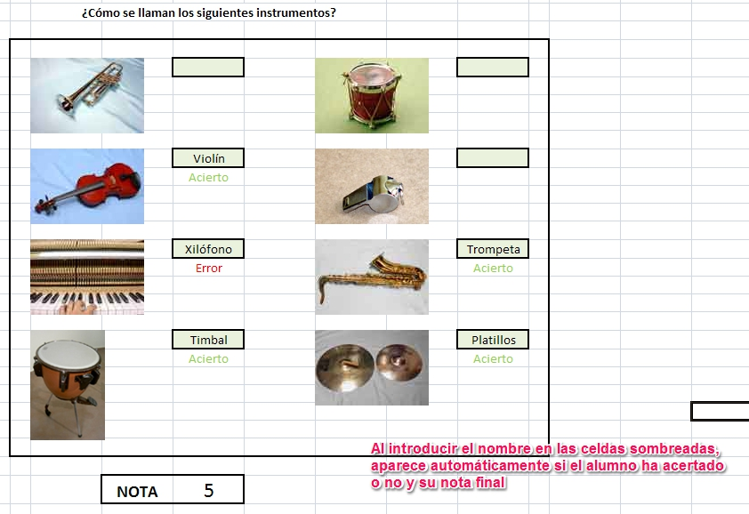
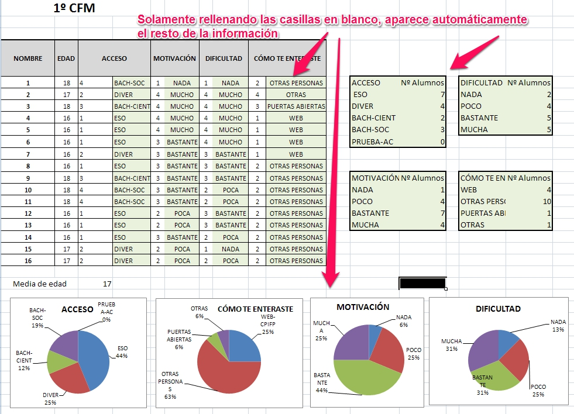

# Aplicaciones

Cuando pensamos en una **hoja de cálculo** nos vienen a la cabeza multitud de aplicaciones relacionadas con el campo de la economía y las finanzas: nos permite generar presupuestos, gráficas estadísticas, facturas, análisis de bolsa, ventas, inventarios...

Pero, aunque no sea tan evidente, también existen numerosas aplicaciones en el **ámbito docente.** 

En esta unidad vamos a describir algunos ejemplos y vamos a pensar en otras posibilidades que nos pueden ayudar en nuestro trabajo diario con alumnos.

Empecemos mostrando algunas posibilidades:

- En el ámbito de las **Matemáticas**, las posibilidades son numerosas. Échale un vistazo a estos recursos: [recurso 1](http://www.educarm.es/templates/portal/images/ficheros/alumnos/1/secciones/4/contenidos/859/Index.htm) y [recurso 2](http://recursostic.educacion.es/descartes/web/materiales_didacticos/suma1/#intro). Como ves, puede utilizarse para que los alumnos comprueben sus conocimientos sobre casi cualquier tema.

 

- En **Lengua y Literatura** o también en **Idiomas, **en** Plástica **o en** Música**, puede utilizarse la hoja de cálculo como un juego interactivo en el que los alumnos aciertan diversas preguntas sobre cualquier tema. A continuación puedes ver un ejemplo:

|**Figura 1.04: Captura de pantalla propia. Juego de los aciertos aplicado al área de Música**

 

- En el ámbito de las **Ciencias Sociales**, también puede sacarse mucho rendimiento a la aplicación, ya que, a partir de datos conocidos (extraídos por ejemplo de la página del [Instituto Nacional de Estadística](http://www.ine.es/)) puede representarse cualquier tipo de gráfico, sobre el que trabajar e interpretar. 

 

- En **Tecnología**, las posibilidades son ilimitadas. Podemos aplicar la hoja de cálculo, desde a la elaboración de los presupuestos en el taller, hasta ejercicios de electricidad como el cálculo de resistencias serie, paralelo o mixtas, o incluso de la determinación de su valor a partir del código de colores. Observa algunos ejemplos en este [enlace](http://platea.pntic.mec.es/~lgonzale/tic/calculo/circuitos.html).

 

- En el ámbito de las **Ciencias Naturales y Física y Química **también podemos aprovechar las ventajas que nos aportan las hojas de cálculo. Lo podemos ver en este [ejemplo](https://fisquiweb.es/hojascalc.htm).

 

- En cualquier asignatura y en la labor de **tutoría**, puede utilizarse esta aplicación para pasar formularios a los alumnos y que automáticamente podamos tratar las respuestas para obtener resultados individuales, estadísticas, gráficas, etc, como puedes observar en el siguiente ejemplo:

|**Figura 1.05: Captura de pantalla propia. Resultados de encuestas en una hoja de cálculo**

 

Esta es solo una pequeña aproximación a la infinidad de utilidades que se nos abren con el uso de las hojas de cálculo. 

 

## Tarea

Ahora que ya has visto algunos ejemplos de utilización de las hojas de cálculo, añade un mensaje en el foro del curso en el que describas cómo podrías utilizar tú las hojas de cálculo en tu actividad diaria como profesor. Indica el curso o nivel y la especialidad en que trabajas y describe el uso que le darías a la hoja de cálculo dentro de tu clase.

