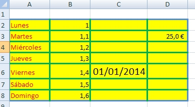

# Autoevaluación

## Caso práctico

Crea una hoja de cálculo, utilizando el programa que prefieras, con las siguientes condiciones:

- El rango A2:A8 debe contener los días de la semana escritos en color rojo 

- El rango B2:B8 debe contener una serie de números, que constituyan una serie aritmética que comience con el número 1 y cuyo incremento sea 0,1 (utilizando la opción "Rellenar/series" ).

- La celda C6 debe contener la fecha de 01/01/2014 en formato fecha, y debe tener un tamaño de 16

- La celda D3 debe contener la cifra 25 con formato moneda (euro) con un decimal

- El rango A2:D8 debe tener un borde exterior grueso de color azul, bordes interiores verdes y un relleno amarillo

%accordion%Solución%accordion%

%/accordion%

