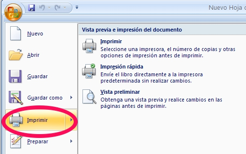
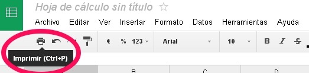

# Configurar página e imprimir

**Imprimir**

En cualquiera de los tres programas vistos en el curso puede imprimirse de la misma forma, eligiendo una de las tres opciones siguientes:

 

| | **Figura 4_03: Captura de pantalla propia. Imprimir**

| |  **Figura 4_04: Captura de pantalla propia. Imprimir**
| - Utilizar la combinación de teclas ****CTRL + P**.**| 

 

 

 

 

 

 

 

 

 

 

 

 

 

 

 

 

 

 

 

**Configurar página** 

Además, en cualquiera de los programas vistos en el curso existe la posibilidad de controlar la manera en que se imprimirá una página.

Todos los programas permiten la visualización de una presentación preliminar de la impresión y, además, la modificación de una serie de propiedades con la finalidad de mejorar la presentación impresa.

Entre las propiedades que pueden modificarse destacan las siguientes:

- **Orientación**: pudiendo elegir entre horizontal o vertical.

- **Escala**: permitiendo aumentar o disminuir el tamaño de la hoja de cálculo respecto al papel.

- **Encabezado y pie de página**

- **Márgenes**: pudiendo cambiarlos tanto con el ratón como con sus medidas. Pueden modificarse tanto los márgenes del papel como los del encabezado y pie de página.

 

Para saber más sobre la configuración e impresión en cada uno de los programas, puedes acceder a los siguientes enlaces:

 

Apache Open Office: [calc](http://wiki.open-office.es/Imprimir_en_OpenOffice_Calc)

Google: [drive](https://support.google.com/drive/answer/40617?hl=es)

Microsoft Excel: [2007 ](http://office.microsoft.com/es-es/excel-help/imprimir-una-hoja-de-calculo-o-un-libro-HP010021541.aspx)[2010](http://office.microsoft.com/es-es/excel-help/imprimir-una-hoja-de-calculo-o-un-libro-HP010342797.aspx)

