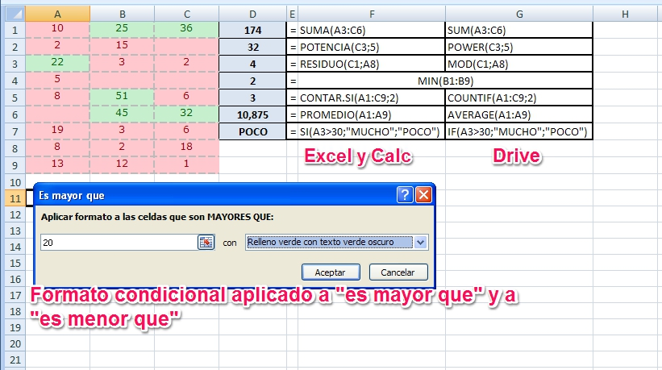

# Ejemplos de funciones

Si has revisado el listado completo de funciones de alguno de los programas que estamos tratando, te habrás dado cuenta que se hacen interminables. A modo de curiosidad, decirte que soportan mas de 300 funciones.

Por eso en este apartado, vamos a introducir las funciones más utilizadas. Puedes ir practicando o simplemente léelas para que en algunos ejercicios puedas aplicarlas, seguro que te parecerán muy útiles para su aplicación en clase. En el tema siguiente las aplicaremos a ejemplos concretos.

Ten en cuenta, que aunque en la columna de ejemplos hagamos operaciones con números para que resulte más sencilla su comprensión, en la práctica, los números son en realidad celdas o rangos de celdas.

 
<td style="background-color: #edc74e; text-align: center;">**EXCEL**</td><td style="background-color: #edc74e; text-align: center;">**CALC**</td><td style="background-color: #edc74e; text-align: center;">**DRIVE**</td><td style="text-align: center;">**EJEMPLO**</td>
<td colspan="2" style="background-color: #f8eaa9; text-align: center;">******<em>SUMA(número1;número2;….)****</em>**</td><td style="background-color: #f8eaa9; text-align: center;">****SUM(número_1; número_2;...)** **</td>|**Efectúa la suma de cada uno de los argumentos.**Ejemplo =Suma(24;20) devuelve 44 que es la suma de 24+20
<td colspan="2" style="background-color: #f8eaa9; text-align: center;">****POTENCIA(número;potencia)****</td><td style="background-color: #f8eaa9; text-align: center;">****POWER(base; potencia)**** </td>|**Calcula el resultado de elevar un número a una potencia.****Ejemplo: **=Power(3;3) devuelve 27 que es 33
<td colspan="2" style="background-color: #f8eaa9; text-align: center;">****RAIZ(número)****</td><td style="background-color: #f8eaa9; text-align: center;">****SQRT(número)**** </td>|**Halla la raíz cuadrada de un número****Ejemplo: ** =Raiz(144) devuelve el valor 12
<td colspan="2" style="background-color: #f8eaa9; text-align: center;">****PRODUCTO(número1;número2;…)**** </td><td style="background-color: #f8eaa9; text-align: center;">****PRODUCT(número_1;********número_2;...)****</td>|**Realiza la multiplicación de todos los argumentos.****Ejemplo:** =Producto(5;8) devuelve 40 que es el resultado 5*8
<td colspan="2" style="background-color: #f8eaa9; text-align: center;">******<em>REDONDEAR(número;****</em>********<em>num_de_decimales)****</em>** </td><td style="background-color: #f8eaa9; text-align: center;"> ****ROUND(número; decimales)****</td>|**Redondea un número al nº de decimales especificado.****Ejemplo: **Redondear(166,3867;2) devuelve 166,39
<td colspan="2" style="background-color: #f8eaa9; text-align: center;"> ****RESIDUO(num;num_divisor)****En versión 2010:** **RESTO****** **</td><td style="background-color: #f8eaa9; text-align: center;">****MOD(dividendo; divisor)**** </td>|**Calcula la división de los números dados como argumentos y devuelve el resto o residuo de la división** Ejemplo:=Residuo(25;4) devuelve 1 que es el resto de la división
<td colspan="3" style="background-color: #f8eaa9; text-align: center;"> **MAX(número1;número2;…)**  </td><td style="text-align: justify;"> **Devuelve el valor máximo de un rango**, el rango estará formado por valores numéricos.</td>
<td colspan="3" style="background-color: #f8eaa9; text-align: center;">**MIN(número1;número2;…)**  </td><td style="text-align: justify;">**Devuelve el valor mínimo de un rango**, el rango estará formado por valores numéricos</td>
<td colspan="2" style="background-color: #f8eaa9; text-align: center;">**PROMEDIO(número1;número2;…)** </td><td style="background-color: #f8eaa9; text-align: center;">****AVERAGE(número1;número2;…) ****</td><td style="text-align: justify;">**Calcula la media aritmética de los valores numéricos incluidos**</td>
<td colspan="2" style="background-color: #f8eaa9; text-align: center;">****CONTAR(rango)**** </td><td style="background-color: #f8eaa9; text-align: center;">****COUNT******(rango)** </td><td style="text-align: justify;">**Cuenta las veces que aparece un elemento numérico en un rango,** es decir, cuenta las celdas ocupadas por números</td>
<td colspan="2" style="background-color: #f8eaa9; text-align: center;">**Contar.Si(rango;criterio)** </td><td style="background-color: #f8eaa9; text-align: center;">**** COUNTIF(rango;criterio)****</td>|**Cuenta el número de veces que aparece un valor en el rango indicado**.Ejemplo: Contar.Si(A7:A30;8) cuenta el número de veces que aparece el número 8 en el rango indicado
<td colspan="2" style="background-color: #f8eaa9; text-align: center;">**Si(prueba_lógica;valor_si_verdadero;****valor_si_falso)** </td><td style="background-color: #f8eaa9; text-align: center;">******IF(prueba_lógica;valor_si_verdadero;************valor_si_falso)** ****</td>|**Comprueba una condición que ha de ser verdadera o falsa**. Si es verdadera la función devuelve un valor (valor_si_verdadero) y si es falsa otro. 
<td colspan="2" style="background-color: #f8eaa9; text-align: center;">**BUSCARV (valor_buscado;rango;****indicador_columnas;ordenado)**En versión 2010:**** CONSULTAV****</td><td style="background-color: #f8eaa9; text-align: center;">**VLOOKUP (valor_buscado;rango;****indicador_columnas;ordenado)**</td><td style="text-align: justify;">**Examina la primera columna de un rango de celdas buscando un valor determinado, cuando ha sido localizado el valor buscado devuelve el dato incluido en esa mima fila y en la columna que ha sido especificada.**</td>
|Asociadas a las fórmulas anteriores existe una orden muy útil en la elaboración de aplicaciones con hojas de cálculo. Se trata del **formato condicional**.Este comando permite cambiar el formato a aquellas celdas que cumplan una determinada condición que yo impongo. Es muy útil cuando queremos resaltar resultados que cumplan una o varias condiciones determinadas, por ejemplo, mostrar los resultados de alumnos con calificación mayor que 5 en color verde, y el resto en color rojo.Puedes aprender a utilizar esta orden en los siguientes enlaces:- Si utilizas la hoja de cálculo de Microsoft [Excel](http://office.microsoft.com/es-es/excel-help/inicio-rapido-aplicar-formato-condicional-HA010370614.aspx) 2007 o 2010.- Si utilizas la hoja de cálculo de [Calc](http://wiki.open-office.es/Formato_condicional_en_Calc) de Apache OpenOffice.- Si utilizas [Drive ](https://support.google.com/drive/answer/78413?hl=es&amp;ref_topic=1361472)de Google.

# Caso práctico

Prueba todas las funciones vistas en este tema. Para ello utiliza los siguientes datos:
<td style="background-color: #cdccca; text-align: center;">** **</td><td style="background-color: #cdccca; text-align: center;">**A**</td><td style="background-color: #cdccca; text-align: center;">**B**</td><td style="background-color: #cdccca; text-align: center;">**C**</td>
<td style="background-color: #cdccca; text-align: center;">**1**</td><td style="text-align: center;">10</td><td style="text-align: center;">25</td><td style="text-align: center;">36</td>
<td style="background-color: #cdccca; text-align: center;">**2**</td><td style="text-align: center;">2</td><td style="text-align: center;">15</td><td style="text-align: center;"> </td>
<td style="background-color: #cdccca; text-align: center;">**3**</td><td style="text-align: center;">22</td><td style="text-align: center;">3</td><td style="text-align: center;">2</td>
<td style="background-color: #cdccca; text-align: center;">**4**</td><td style="text-align: center;">5</td><td style="text-align: center;"> </td><td style="text-align: center;"> </td>
<td style="background-color: #cdccca; text-align: center;">**5**</td><td style="text-align: center;">8</td><td style="text-align: center;">51</td><td style="text-align: center;">6</td>
<td style="background-color: #cdccca; text-align: center;">**6**</td><td style="text-align: center;"> </td><td style="text-align: center;">45</td><td style="text-align: center;">32</td>
<td style="background-color: #cdccca; text-align: center;">**7**</td><td style="text-align: center;">19</td><td style="text-align: center;">3</td><td style="text-align: center;">6</td>
<td style="background-color: #cdccca; text-align: center;">**8**</td><td style="text-align: center;">8</td><td style="text-align: center;">2</td><td style="text-align: center;">18</td>
<td style="background-color: #cdccca; text-align: center;">**9**</td><td style="text-align: center;">13</td><td style="text-align: center;">12</td><td style="text-align: center;">1</td>

Realiza las operaciones siguientes:

- En D1 debe aparecer la suma del rango A3:C6
- En D2 debe aparecer la quinta potencia de la celda C3
- En D3 debe aparecer el resto de la división entre las celdas C1 y A8
- En D4 debe aparecer el valor mínimo de la columna B
- En D5 debe aparecer el número de veces que se repite el número 2 en toda la tabla
- En D6 debe aparecer la media aritmética de la primera columna
- En D7 debe aparecer la palabra MUCHO si el contenido de la celda A3 es mayor que 30 y debe aparecer la palabra POCO si es menor
- En el rango A1:C9 debe aparecer las celdas con números mayores que 20 en verde y las menores o iguales en rojo.

<input class="feedbackbutton" name="toggle-feedback-quesFeedback0b58" onclick="$exe.toggleFeedback(this,true);return false" type="button" value="Mostrar retroalimentación"/>

# Retroalimentación

|**Figura 2_9: Captura de pantalla propia. Solución ejercicio**

