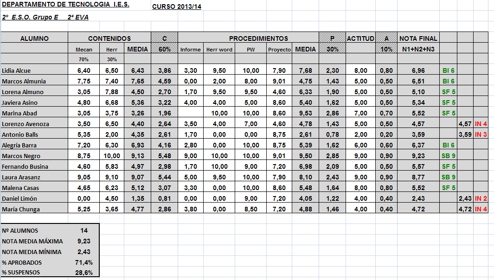
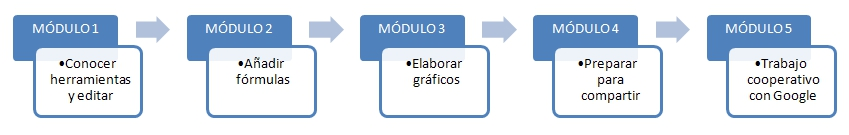

# 1. Comenzando con las hojas de cálculo

##¿Qué es esto de las hojas de cálculo?

En nuestro trabajo cotidiano encontramos situaciones que se repiten a lo largo del curso y en años sucesivos: contabilizamos faltas de asistencia, repetimos temas en los distintos grupos de un mismo nivel, recuperamos actividades...

Quizás el proceso más ingrato es el de evaluar a nuestros alumnos: medias, porcentajes, contabilizar aprobados y suspensos... en fin, un trabajo repetitivo y tedioso que reiteramos evaluación tras evaluación, y año tras año.

¿No sería estupendo que pudiéramos simplemente anotar las calificaciones y que, por arte de magia, apareciera todo lo demás.

Pues eso no es magia.... eso es una **HOJA DE CÁLCULO**

Observa el siguiente ejemplo:

 

Simplemente tenemos que introducir los datos en las casillas en blanco, y automáticamente aparecen rellenas las casillas sombreadas. Además, y eso es uno de los principales atractivos de las hojas de cálculo, si nos equivocamos en un dato, lo corregimos, y automáticamente se recalculan todos los demás valores.

## Esquema del curso

Pero ¿qué pasos son los que hemos de seguir para conseguir esta aplicación? Observa el siguiente gráfico:

 

- En primer lugar, debemos conocer los programas que podemos utilizar para elegir el que más nos convenga, escribir los datos que van a ser fijos (en este caso, encabezados de columnas, nombres de alumnos e instrumentos de evaluación) y darles un formato adecuado. Eso lo veremos en el Módulo 1.

- En segundo lugar, queremos añadir las fórmulas necesarias para que automáticamente aparezcan todos los resultados que buscamos. Es lo que aprenderemos en el Módulo 2.

- A continuación, y en los casos que consideremos oportunos, añadiremos gráficos que faciliten la interpretación de datos. Este será el cometido del Módulo 3.

- En cuarto lugar, prepararemos el documento, bien para imprimirlo, bien para compartirlo con otros, a través del correo electrónico, blogs u otros canales. Esto último lo aprenderemos en el Módulo 4.

- Reservamos el último módulo para mostrar un tipo de aplicación de Google Drive, que nos permitirá crear formularios e interpretar los resultados automáticamente. Sobre esto tratará el Módulo 5.

## Objetivos

En este primer módulo los objetivos que queremos alcanzar son los siguientes:

- Entender qué es una hoja de cálculo.

- Darnos cuenta del alcance real de la aplicación, a través de diversos ejemplos.

- Conocer tres programas distintos de hoja de cálculo: Microsoft Excel, Calc y Google Drive y aprender a añadir y editar datos, y dar el formato adecuado.