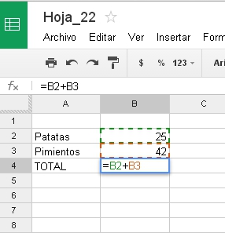

# Módulo 2: Trabajando con fórmulas

Las tablas creadas en el módulo 1 quedan muy vistosas, son fáciles de modificar... pero la verdadera utilidad de las hojas de cálculo, la da precisamente su nombre:

**CALCULAR**

es decir, realizar operaciones con funciones, que automaticen los procesos y nos faciliten el trabajo cuando manejamos cantidades de datos elevadas.
|<object data="Introduccion_M2.swf" height="240" type="application/x-shockwave-flash" width="320"><param name="src" value="Introduccion_M2.swf"/></object>
|**Autor: [CNICE](recursostic.educacion.es/bancoimagenes/web/). Licencia Creative Commons Attribution-NonCommercial-ShareAlike 3.0 Unported. Fórmulas matemáticas **

 

Cuando en las operaciones que necesitamos intervienen pocos datos y además son operaciones sencillas, es decir, cuando realizamos sumas, restas, multiplicaciones o divisiones, podemos utilizar los caracteres +, -, * y / del teclado, siempre anteponiendo el signo "=" antes de la operación.

Lo primero que hay que comprender es que ralizaremos las operaciones, no con valores, sino con celdas. ¿Por qué se hace de esta manera? Porque de esta forma, en el caso de que los datos iniciales cambien, el programa recalcula automáticamente las soluciones. 

Observa el siguiente ejemplo:

<td colspan="2">**Figura 2_01: Captura de pantalla propia. Operación Suma en una hoja de cálculo**</td>

 

** **

# Importante

Otra forma más rápida de indicar las celdas que queremos que intervengan en una operación es señalarlas directamente con el ratón.

En el ejemplo anterior, nos situamos sobre la celda B4 y escribimos =

A continuación hacemos clic con el ratón en la celda B2

Escribimos el signo +

Por último hacemos clic con el ratón en la celda B3 y damos a Enter

# Objetivos

En este segundo módulo los objetivos que queremos alcanzar son los siguientes:

- Entender la sintaxis de una fórmula.

- Diferenciar entre referencias absolutas y relativas.

- Saber utilizar correctamente funciones que hagan operaciones sencillas como sumar, promediar, raíces, máximos, mínimos, contar, operaciones lógicas, buscar entre los datos algunos que cumplan una determinada condición, etc.

 

Todo lo anterior en cualquiera de los tres programas que componen el curso, a tu elección.

 

