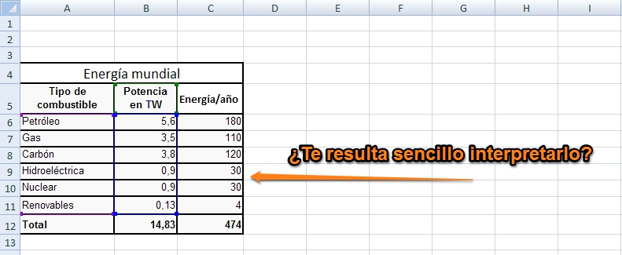
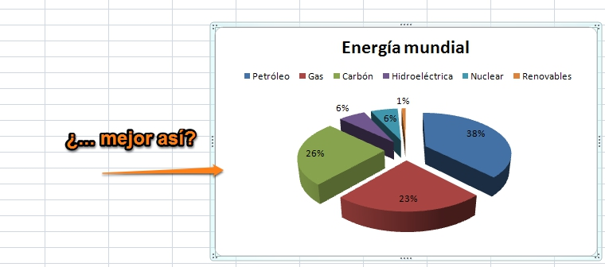

# MÓDULO 3: Gráficos

 

En las prácticas anteriores hemos conseguido generar hojas de cálculo en las que hemos obtenido un gran número de datos, pero muchas veces resulta farragoso interpretarlos.

 

Observa este ejemplo sobre Consumo de Energía mundial

|**Figura 3_1: Captura de pantalla propia. Ejemplo sobre consumo de energía mundial**

  

Fíjate en como podemos representar los datos reflejados en la tabla anterior de una manera más visual

 

|**Figura 3_2: Captura de pantalla propia. Ejemplo sobre gráficos**

 

Muchas veces necesitamos poder representar los resultados de manera gráfica para facilitar su interpretación.

Los gráficos nos permiten presentar de forma visual los datos de una hoja de cálculo, con la enorme ventaja de que, si estos datos cambian, el gráfico se actualiza automáticamente.

En este módulo vamos a aprender a crear y modificar gráficos que mejoren nuestros resultados.

# Objetivos

Los objetivos que vamos a alcanzar en este módulo son los siguientes:

- Identificar los diferentes componentes de los gráficos.
- Crear gráficos a partir de series de datos.
- Conocer y utilizar los distintos tipos de gráficos.
- Modificar gráficos

