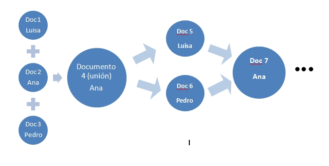
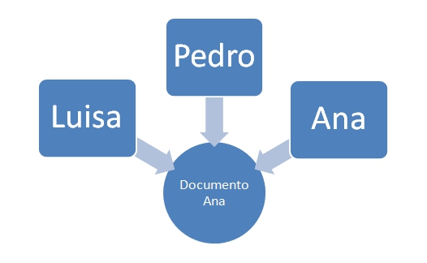

# M5: Trabajo cooperativo

Siempre que en clase planteamos la posibilidad de realizar trabajos en grupo en horario extraescolar, nos encontramos con el problema de alumnos que viven en poblaciones distintas y no pueden quedar por las tardes. 

Esto queda solucionado con la posibilidad de elaborar **documentos colaborativos**.

Si utilizamos hojas de cálculo (aunque también es aplicable a procesadores de texto o programas de elaboración de presentaciones) "convencionales", para elaborar un trabajo en grupo a distancia, cada alumno tendría que realizar su parte del trabajo y luego ponerlo en común.

Por ejemplo, si Ana, Luisa y Pedro realizan un trabajo en grupo pero no pueden quedar para hacerlo, lo más lógico sería que dividieran el trabajo en tres, cada uno hiciera su parte y luego eligieran a uno de ellos que recibiera los otros dos trabajos por correo electrónico, por ejemplo Ana. Una vez recibidos, Ana los uniría y después, otra vez por correo, enviaría a Luisa y Pedro, el trabajo completo para revisarlo y aportar correcciones. Por correo otra vez enviarían a Ana las correcciones, que las mejoraría y volvería a enviarles el trabajo final...

|**Figura 5_01: Captura de pantalla propia. Trabajo en grupo**

 

En fin, resultaría un proceso largo y poco operativo, ya que se irían generando copias del documento original que, a su vez, cada uno iría modificando por separado, con lo que aumentaría el riesgo de confusiones.

El proceso anterior mejora notablemente usando todas las posibilidades que ofrece Google Drive.

Ana crea un documento con su cuenta de Google e invita a sus dos compañeros a acceder a él (a través de sus mails). A partir de ese momento, los tres pueden acceder al único documento que existe e ir modificándolo, ya que los cambios se guardan automáticamente.

|**Figura 5_02: Captura de pantalla propia. Trabajo cooperativo**

 

 Es decir, existe **un único documento** sobre el que los tres pueden trabajar online y que se actualiza automáticamente.

# Objetivos

En este último módulo pretendemos alcanzar los siguientes objetivos:

- Conocer aplicaciones del trabajo cooperativo

- Compartir archivos

- Utilizar formularios de Google Drive

- Conocer alguna herramienta de interpretación automática de resultados

