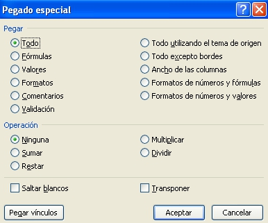
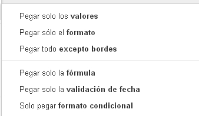
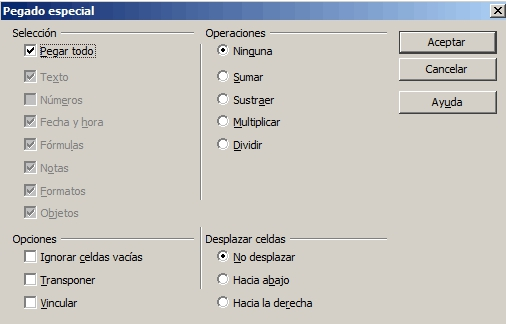

# Operaciones con funciones

Muchas veces, al manejar grandes cantidades de información, la adición de fórmulas se convierte en un hecho reiterativo. En el ejemplo que has realizado en la página anterior, has tenido que escribir una fórmula prácticamente igual varias veces.

Para evitar tener que escribir la misma fórmula una vez tras otra, existe la posibilidad de copiar y pegar las funciones.

Al igual que ocurre con los datos, las funciones también se comportan de igual manera al copiarlas en otras ubicaciones, ya que se actualizan a la nueva posición, pudiendo aprovechar la definición de una función en otras estructuras similares que se construyan.

Para **copiar y pegar fórmulas** en otros lugares de la hoja de cálculo, independientemente del programa que utilicemos, tenemos varias posibilidades:

- Seleccionar la celda que contiene la fórmula que deseamos copiar y desde el menú Edición (o Editar) elegir Copiar (o desde el teclado CTRL+C). A continuación situar el cursor en la celda donde queremos tener la nueva fórmula y desde el menú Edición (o Editar) elegir Pegar (o desde el teclado CTRL+V).

- En los casos en que queramos copiar a celdas adyacentes puede utilizarse otro método: Seleccionar la celda que contenga la fórmula. Pulsar en la parte inferior derecha en el marco destacado que rodea la celda y mantener pulsado el botón del ratón. El puntero del ratón se convierte en un retículo. Mantener pulsado el botón del ratón y tirar hacia abajo o hacia la derecha sobre las celdas en las que desee copiar la fórmula. Soltar el botón del ratón. La fórmula se copiará en las celdas y se adaptará automáticamente, como se observa en la siguiente animación:
|<object data="suma.swf" height="315" type="application/x-shockwave-flash" width="420"><param name="src" value="suma.swf"/></object>
<td style="text-align: center;">**Pegado de funciones en una hoja de cálculo. Autora: Carmen Tobeña**</td>

 

Como has podido observar al copiar y pegar una fórmula automáticamente la función se ajusta a la nueva celda. Si te fijas en la barra de fórmulas del ejemplo anterior, la función inicial **=A1+B1** se transforma en **=A2+B2** al copiar en la segunda fila, y así sucesivamente hasta que al pegarla en la quinta fila aparece automáticamente **=A5+B5**.

   

En algunas ocasiones necesitamos pegar solamente una parte de toda la información que contiene la celda (formato, fórmulas, números...).

En estos casos utilizamos un tipo específico de pegado que se conoce como **pegado especial**, al que se accede debajo de la opción de pegado explicada anteriormente.

Todos los programas nos ofrecen varias posibilidades comunes a la hora de pegar funciones,entre las que destacan:

- Pegar solo ****valores** **(en Calc activar en el área **Selección** las opciones **Texto**, **Números** y **Fecha y hora): **pega solamente los resultados de las operaciones pero no las fórmulas.
- Pegar ****fórmulas****: pega el texto y las fórmulas, sin el formato de las celdas.
- Pegar ****formato****: pega el formato pero sin el contenido.

A partir de ahí cada programa tiene sus diferencias, como puedes observar al comparar las tres opciones:

<td colspan="2"> **Figura 2_03: Captura de pantalla propia. Ventana de pegado especial en todas las versiones de Microsoft Excel** </td>

<td colspan="2" style="text-align: right;">**Figura 2_04: Captura de pantalla propia. Opciones de pegado especial en Google Drive**  </td>

<td colspan="2">**Figura 2_05:  Captura de pantalla propia. Ventana de pegado especial en Calc de Apache OpenOffice**</td>

 

 

 

# Rellenar huecos

Lea el párrafo que aparece abajo y complete las palabras que faltan.

Si queremos que en una celda se pegue la fórmula pero sin el formato de la celda, utilizaremos un tipo de pegado especial que se llama pegar 
<label class="sr-av" for="clozeBlank53_21.0">Rellenar huecos (1):</label>
<input class="autocomplete-off" id="clozeBlank53_21.0" onkeyup="$exe.cloze.change(this)" style="width:8em" type="text" value=""/>
JXUwMDNlJXUwMDk1JXUwMDgxJXUwMDFmJXUwMDE4JXUwMDE5JXUwMDBkJXUwMDEy

 .

Si por el contrario queremos pegar las celdas pero intercambiando filas por columnas, utilizaremos la opción 
<label class="sr-av" for="clozeBlank53_21.1">Rellenar huecos (2):</label>
<input class="autocomplete-off" id="clozeBlank53_21.1" onkeyup="$exe.cloze.change(this)" style="width:10em" type="text" value=""/>
JXUwMDJjJXUwMDA2JXUwMDEzJXUwMDBmJXUwMDFkJXUwMDAzJXUwMDFmJXUwMDAxJXUwMDBiJXUw
MDE3

 .

Cuando queremos evitar pegar las celdas de origen que estaban vacías, podemos utilizar el pegado especial 
<label class="sr-av" for="clozeBlank53_21.2">Rellenar huecos (3):</label>
<input class="autocomplete-off" id="clozeBlank53_21.2" onkeyup="$exe.cloze.change(this)" style="width:6em" type="text" value=""/>
JXUwMDJiJXUwMDEyJXUwMDBkJXUwMDE4JXUwMDE1JXUwMDEz

<label class="sr-av" for="clozeBlank53_21.3">Rellenar huecos (4):</label>
<input class="autocomplete-off" id="clozeBlank53_21.3" onkeyup="$exe.cloze.change(this)" style="width:7em" type="text" value=""/>
JXUwMDNhJXUwMDBlJXUwMDBkJXUwMDBmJXUwMDBkJXUwMDBjJXUwMDFj

 en Excel o 
<label class="sr-av" for="clozeBlank53_21.4">Rellenar huecos (5):</label>
<input class="autocomplete-off" id="clozeBlank53_21.4" onkeyup="$exe.cloze.change(this)" style="width:7em" type="text" value=""/>
JXUwMDExJXUwMDJlJXUwMDA5JXUwMDAxJXUwMDFkJXUwMDEzJXUwMDEz

<label class="sr-av" for="clozeBlank53_21.5">Rellenar huecos (6):</label>
<input class="autocomplete-off" id="clozeBlank53_21.5" onkeyup="$exe.cloze.change(this)" style="width:6em" type="text" value=""/>
JXUwMDNiJXUwMDA2JXUwMDA5JXUwMDA4JXUwMDA1JXUwMDEy

<label class="sr-av" for="clozeBlank53_21.6">Rellenar huecos (7):</label>
<input class="autocomplete-off" id="clozeBlank53_21.6" onkeyup="$exe.cloze.change(this)" style="width:6em" type="text" value=""/>
JXUwMDJlJXUwMDE3JXUwMDAyJXUwMDhlJXUwMDhjJXUwMDEy

 en Calc.

<input id="getScore53_21" onclick="$exe.cloze.showScore('53_21')" type="button" value="Averiguar la puntuación"/>
<input id="showAnswersButton53_21" name="53_21showAnswersButton" onclick="$exe.cloze.toggleAnswers('53_21')" style="" type="button" value="Mostrar/Eliminar las respuestas"/>
Habilitar JavaScript

