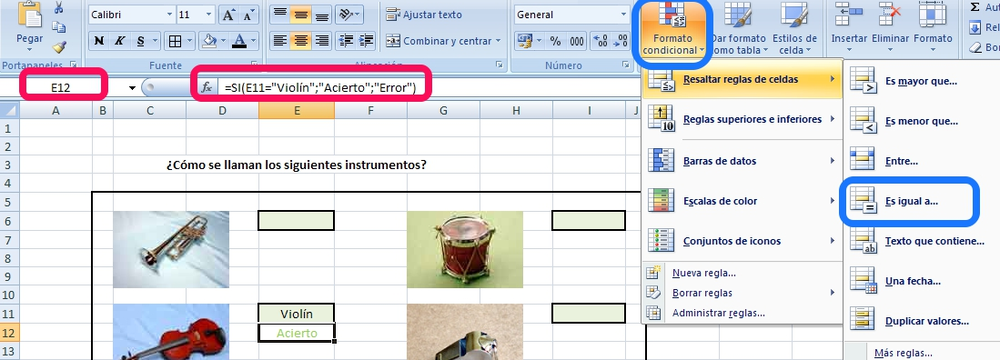
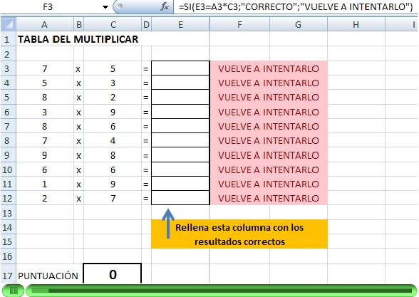
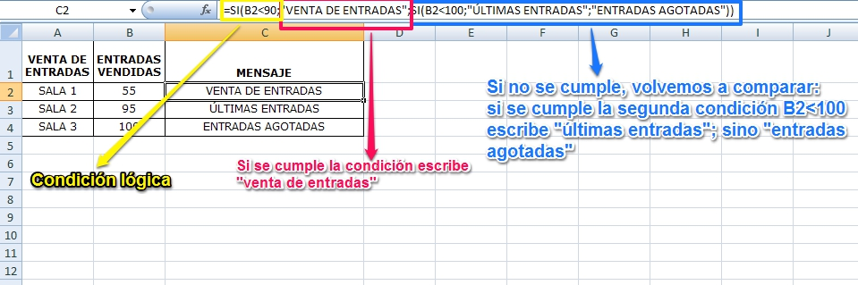
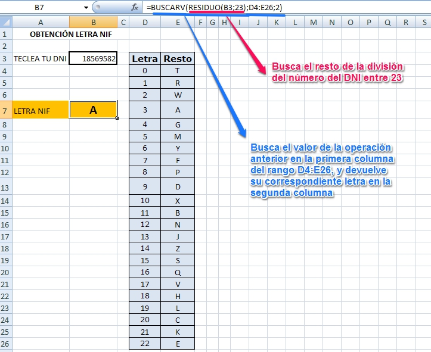

# Propuestas didácticas

¿Te acuerdas de los ejemplos de aplicaciones de hoja de cálculo que te presentamos en el Módulo 1?

Pues todas esas actividades pueden realizarse con las fórmulas vistas en el apartado anterior. Vamos a analizar algunos ejemplos. En todos ellos vamos a utilizar el nombre de la función en castellano, por comodidad, pero tienes su conversión al inglés en el tema anterior, al describir ejemplos de funciones.

Muchas de las prácticas mostradas permiten la interactividad del alumnado a través de una retroalimentación que les muestra un mensaje indicando si han acertado o no. Fíjate en el ejemplo sobre instrumentos musicales:

Como has podido observar, además de darle el formato adecuado, para que aparezca automáticamente "acierto" o "error" hemos utilizado la función lógica **SI**. Esta función puede utilizarse con datos numéricos o con datos de texto, como en este caso. El único cambio es que tenemos que encerrar el texto entre **comillas** para que el programa entienda que lo que tiene que buscar es un texto.

Esta condición es muy útil cuando queremos crear aplicaciones para que el alumnado demuestre que conoce la ortografía correcta de las respuestas.

Además, para que el resultado aparezca en rojo o verde según se haya acertado o no, podemos utilizar el **formato condicional**, como ves en la imagen anterior.

Ahora solo restaría darle a la aplicación un formato adecuado y vistoso.

___

- En muchos ejemplos de los que hemos mostrado en el Módulo 1, las aplicaciones contienen un indicador de la nota del alumno en cada momento, que va variando al contestar cada pregunta. Una posible solución sería la mostrada en el siguiente ejemplo:

La fórmula utilizada para obtener la puntuación ha sido la siguiente: **=CONTAR.SI(F3:F12;"CORRECTO")** en la que se cuenta el número de veces que aparece la palabra “correcto” en el rango especificado [F3:F12]

En este caso cada acierto equivale directamente a un punto, pero si no fuera así, bastaría con multiplicar la función CONTAR por el valor de cada pregunta.

> **info**
>## Importante

>Imagina que queremos crear una hoja de cálculo para utilizarla en un cine que cuenta con 3 salas, con un >aforo de 100 personas cada una. Además de muchas otras operaciones, la hoja debe darnos un mensaje >dependiendo del número de entradas que queden por vender, de tal forma que nos dirá:

>- **VENTA DE ENTRADAS** cuando se hayan vendido menos de 90
>- **ÚLTIMAS ENTRADAS** cuando las ventas pasen de 90 
>- **ENTRADAS AGOTADAS** cuando se llegue a 100 vendidas

>Tenemos que diseñar la hoja de cálculo que se aproxime al caso anterior, utilizando la siguiente tabla:

>|**VENTA DE ENTRADAS**|**ENTRADAS VENDIDAS**|**MENSAJE**|
>|:---|:--:|:--:|
>|SALA 1| 55 ||
>|SALA 2| 95 ||
>|SALA 3| 100 ||

Como tienen que compararse tres condiciones, no puede utilizarse una función lógica SI como hasta ahora, sino una combinación de dos de ellas. Es esto lo que se conoce como **FUNCIONES ANIDADAS**, es decir, una función dentro de otra. 

En la celda C2 escribiremos la siguiente función:

**=SI(B2&lt;90;"VENTA DE ENTRADAS";SI(B2&lt;100;"ÚLTIMAS ENTRADAS";"ENTRADAS AGOTADAS"))**

El DNI en España, consta de un número de 8 cifras y una letra, que puede obtenerse si se siguen los pasos siguientes:- Calcular el resto de dividir el número entre 23 (Se utilzan 23 letras por ser 23 un número primo, las letras que no se utilizan son I, Ñ, O, U. Cuando se planteó de que letras prescindir, se optaron por estas o bien por que no eran estándares del código ASCII (la Ñ) o bien por que se podrían confundir con otras letras o números (I, O, U)- El número obtenido está entre 0 y 22, y seleccionaremos la letra asociada a el número de DNI según la siguiente tabla:

|0|1|2|3|4|5|6|7|8|9|10|11|12|13|14|15|16|17|18|19|20|21|22|
|--- |--- |--- |--- |--- |--- |--- |--- |--- |--- |--- |--- |--- |--- |--- |--- |--- |--- |--- |--- |--- |--- |--- |
|T|R|W|A|G|M|Y|F|P|D|X|B|N|J|Z|S|Q|V|H|L|C|K|E|

¿Cómo podríamos obtener esta letra con una hoja de cálculo? hay varias maneras, aquí te explicamos cómo hacerlo utilizando las funciones **RESIDUO** y **BUSCARV** de forma anidada, como ves en la siguiente figura:

 

Esta combinación de funciones es muy útil siempre que queramos relacionar dos columnas entre sí: artículos en venta con precios; colores con valores, por ejemplo para hacer una hoja de cálculo de resistencias según sus colores; números con indicaciones, por ejemplo al interpretar encuestas que utilizan números en respuestas (0 poco, 1 medio, 2 mucho) o similares... pero mucho ojo, solamente responde cuando relacionamos **columnas**, no filas.

Como ves hay infinidad de posibilidades, solamente hay que pensar en la necesidad que quieres satisfacer y descubrir tranquilamente cómo puedes solucionarlo.

**A partir de aquí ... todo lo que te atrevas a imaginar...**

