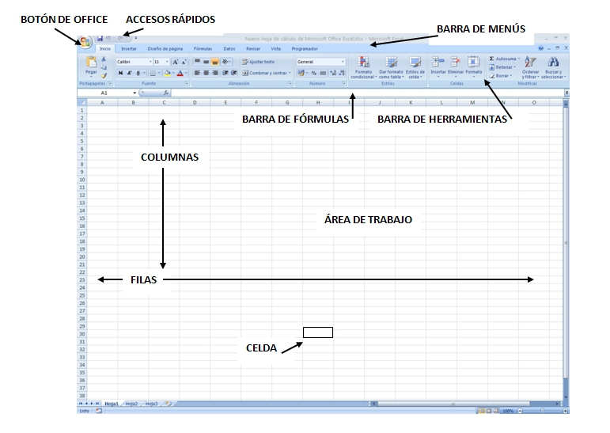

# Tema 1. Microsoft Excel

 

Microsoft Excel es un programa de hoja de cálculo que se encuentra dentro del paquete de Office de Microsoft. En los ordenadores de los centros educativos públicos aragoneses, tenemos instaladas las versiones 2003 o/y 2007.

La principal característica de este programa, en cualquiera de sus versiones, es la elevada cantidad de datos con los que puede operar.

Dependiendo de cual es la versión que tú quieres utilizar deberás consultar un apartado u otro de los siguientes:

 
<td style="text-align: center; background-color: #edc74e;">**Excel 2003**</td>

 

Ya hay en el mercado algunas versiones posteriores como Excel 2007 o Excel 2010, aunque muchas personas siguen utilizando esta versión: **Excel 2003**.

Para conocer el aspecto y los primeros pasos con este programa, puedes visitar el siguiente [enlace](http://e-ducativa.catedu.es/44700165/aula/archivos/repositorio//500/674/html/Unidad_05/pagina_5.html). En él tienes que comprender:

- El punto 2: Excel, en el que se describen los elementos del entorno Excel 2003
- El subapartado 2.1: Introducir datos
- El subapartado 2.2: Formatos

  
<td style="background-color: #edc74e; text-align: center;">**Excel 2007/10**</td>

El programa **Excel 2007** presenta una serie de ventajas respecto a la versión anterior, Excel 2003.

Si estás acostumbrado a esa versión 2003 notarás, desde el momento en que abres el programa, que presenta muchas diferencias. Si quieres saber exactamente donde se encuentra cada comando de la versión anterior en este nuevo Excel 2007 puedes visitar el siguiente [enlace](http://office.microsoft.com/es-es/excel-help/interactiva-guia-de-referencia-de-comandos-de-excel-2003-a-excel-2007-HA010149151.aspx), donde se muestra una Guía interactiva de referencia de comandos entre Excel 2003 y 2007. Si no, a continuación resumimos las principales diferencias. 

El primer cambio que notamos es la interfaz de usuario, es decir, la pantalla que se abre cuando iniciamos el programa. En Office 2003 aparece una barra de menús, pero hay que entrar en cada una para que se desplieguen las barras de herramientas correspondientes. El aspecto de la hoja de cálculo en Excel 2007/2010 es el siguiente:

 

<td style="text-align: center;">**Figura 1.06: Captura de pantalla propia. Pantalla principal Excel 2007/2010**</td>

 

Como puede observarse, las barras de herramientas se despliegan automáticamente al seleccionarlas en las barras de menú, con lo que se ahorra en tiempo y en facilidad de encontrar la orden buscada.

Otra diferencia es que en 2007 aumenta la capacidad, es decir, la superficie de trabajo: pasa de algo mas de 65000 filas y 256 columnas en Excel 2003 a un millón de filas y 16000 columnas en Excel 2007.

Se produce además un aumento de las capacidades de interacción con la aplicación: aumenta a 100 el número de veces que es posible deshacer o se incrementa la longitud máxima de las celdas hasta 32.000 caracteres.

Mejora lo relativo a los gráficos: aparecen nuevos tipos de gráficos, se mejora los que había, se aumenta el número de colores disponibles... Además añade nuevas fórmulas y mejora las existentes, y abre la posibilidad de publicar en .pdf

 

La versión de **Excel 2010** mejora la anterior, en cuanto que no hay límite de celdas, añade nuevos gráficos y funciones y aumenta la precisión.

 

En los siguientes enlaces puedes aprender los primeros pasos con la aplicación **Excel 2007/2010**. En principio solamente tienes que entrar en los apartados que te indicamos a continuación:

- [Guardar y abrir una hoja de cálculo](https://support.office.com/es-co/article/Guardar-y-abrir-una-hoja-de-c%C3%A1lculo-fcf25d88-dcfb-4be1-aa07-bbfa2d6424ba)
- [Conceptos básicos de hojas de cálculo](http://www.aulaclic.es/excel2007/b_2_1_1.htm)
- [Aplicar formato](https://support.office.com/es-HN/article/Escribir-texto-y-aplicar-formato-f56c5c91-e8b6-4023-abb3-640ea00546b7)
- [Series y datos](https://support.office.com/es-hn/article/Rellenar-datos-autom%C3%A1ticamente-en-celdas-de-hojas-de-c%C3%A1lculo-71eeb2f2-d689-459b-be7e-614f03e69012?ui=es-ES&amp;rs=es-HN&amp;ad=HN)

 

|**Figura 1.07: Captura pantalla propia. Primeros pasos con Excel 2007/2010**

## Importante

Recuerda que las extensiones con que guarda Micorsoft Excel son las siguientes:

**. xls** si trabajas con Excel 2003

**. xlsx** si trabajas con versiones posteriores

## Rellenar huecos

Lea el párrafo que aparece abajo y complete las palabras que faltan.

La intersección entre una fila y una columna se denomina 
<label class="sr-av" for="clozeBlank22_21.0">Rellenar huecos (1):</label>
<input class="autocomplete-off" id="clozeBlank22_21.0" onkeyup="$exe.cloze.change(this)" style="width:5em" type="text" value=""/>
JXUwMDNiJXUwMDA2JXUwMDA5JXUwMDA4JXUwMDA1

 . 

Un libro de Excel tiene 
<label class="sr-av" for="clozeBlank22_21.1">Rellenar huecos (2):</label>
<input class="autocomplete-off" id="clozeBlank22_21.1" onkeyup="$exe.cloze.change(this)" style="width:4em" type="text" value=""/>
JXUwMDJjJXUwMDA2JXUwMDE3JXUwMDE2

 hojas de manera predeterminada.

Las 
<label class="sr-av" for="clozeBlank22_21.2">Rellenar huecos (3):</label>
<input class="autocomplete-off" id="clozeBlank22_21.2" onkeyup="$exe.cloze.change(this)" style="width:8em" type="text" value=""/>
JXUwMDNiJXUwMDBjJXUwMDAzJXUwMDE5JXUwMDE4JXUwMDAzJXUwMDBmJXUwMDEy

 se identifican con letras y las 
<label class="sr-av" for="clozeBlank22_21.3">Rellenar huecos (4):</label>
<input class="autocomplete-off" id="clozeBlank22_21.3" onkeyup="$exe.cloze.change(this)" style="width:5em" type="text" value=""/>
JXUwMDNlJXUwMDBmJXUwMDA1JXUwMDBkJXUwMDEy

 con números.

<input id="getScore22_21" onclick="$exe.cloze.showScore('22_21')" type="button" value="Averiguar la puntuación"/>
<input id="showAnswersButton22_21" name="22_21showAnswersButton" onclick="$exe.cloze.toggleAnswers('22_21')" style="" type="button" value="Mostrar/Eliminar las respuestas"/>
Habilitar JavaScript

## ParaSaberMas

En Excel las **medidas** de una celda (ancho de columna y alto de fila) se especifican, por defecto, en píxeles o en puntos.

Si estamos utilizando la versión de 2003, ésto no puede cambiarse.

Sin embargo, la versión 2007 sí permite este cambio:

Desde la vista **Diseño de página** (ficha Vista, grupo Vistas de libro, botón **Diseño de página**), se puede especificar el ancho de una columna o el alto de una fila en pulgadas. En esta vista, la pulgada es la unidad de medida de manera predeterminada, pero puede cambiarse a centímetros o milímetros (Botón de Microsoft Office , **Opciones de Excel**, categoría **Avanzadas**).

 De manera aproximada la relación que existe entre puntos, píxeles y centímetros es la siguiente:  
|**Puntos**|**Píxeles**|**Centímetros**
<td style="text-align: center;">18</td><td style="text-align: center;">24</td><td style="text-align: center;">0.63</td>
<td style="text-align: center;">36</td><td style="text-align: center;">48</td><td style="text-align: center;">1.27</td>
<td style="text-align: center;">72</td><td style="text-align: center;">96</td><td style="text-align: center;">2.54</td>
<td style="text-align: center;">108</td><td style="text-align: center;">144</td><td style="text-align: center;">3.81</td>

  

