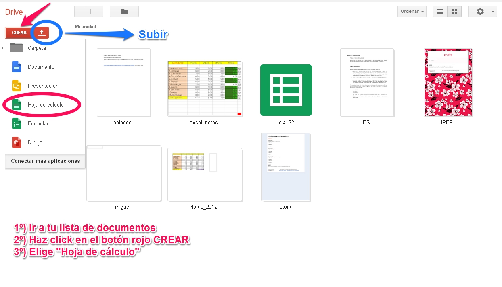
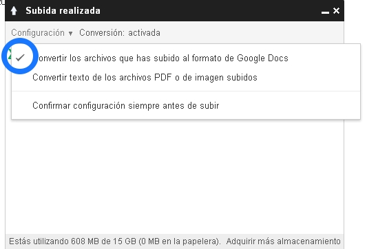
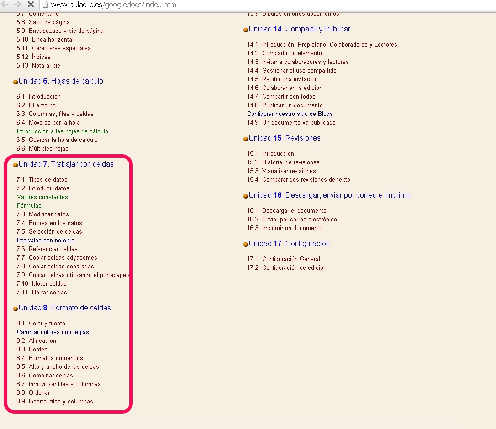

# Tema 3. Google Drive

**Google Drive** es un servicio gratuito de almacenamiento de archivos, en el que se pueden crear nuevos documentos como textos, hojas de cálculo, dibujos y presentaciones. Además permite compartir y editar los documentos.

 

Las principales **ventajas** que presenta son las siguientes:

- Permite el trabajo online, es decir, puedes acceder a tus documentos desde cualquier lugar, conectándote desde cualquier ordenador ([drive.google.com](http://www.google.com/drive/about.html?usp=ad_search&amp;gclid=CNez5uWr_bsCFc3KtAodviUAFQ)) o bien, con la aplicación Drive para móviles.

- Si por el contrario quieres trabajar siempre desde el mismo sitio, también puedes descargarte la versión sin conexión.

- Se dispone de un espacio de 15 GB de almacenamiento gratuito por cuenta, aunque se puede comprar espacio adicional.

- Es compatible con todos los sistemas operativos y con formatos comunes de Microsoft Office (.docx, .xlsx, .pptx), con formato de documento portatil (.pdf), y con formatos de OpenOffice (.odt).

- Permite compartir los documentos realizados y el trabajo cooperativo.

 

En cuanto a sus **limitaciones** podemos destacar la capacidad, ya que dispone de 400.000 celdas, con un máximo de 256 columnas por hoja. Además las hojas de cálculo subidas que se conviertan al formato de Google Drive no pueden ocupar más de 20 MB y deben tener menos de 400.000 celdas y de 256 columnas por hoja.

## Primeros pasos con Google Drive

### Crear un documento nuevo

Accede a tu Lista de documentos desde [http://docs.google.com](http://docs.google.com/), haz clic en el botón rojo **Crear** y selecciona **Hoja de cálculo** en el menú desplegable.

En cuanto le asignes nombre (desde **Archivo**- **Cambiar nombre**) o empieces a escribir, Google Drive lo guardará automáticamente cada pocos segundos. Al inicio del documento, podrás ver la información acerca de la última vez que se guardó. 

### Guardar una copia en tu equipo

Con el documento abierto, selecciona el menú **Archivo** y coloca el cursor sobre la opción **Descargar como**. Puedes optar por guardarlo con los siguientes formatos:

- Microsoft Excel (.xlsx)
- Formato Open Document (.ods)
- Documentos en formato de documento portátil (.pdf)
- Valores separados por comas (.csv)
- Texto sin formato (.txt)
- Página web (.html), 

El archivo se descargará en tu equipo.

### Subir hojas ya creadas

Accede al icono para **subir** documentos que aparece en la parte superior izquierda de la Lista de documentos (marcado en azul en la figura 1.08 anterior). Haz clic en **Archivos**... y selecciona el documento que quieras subir. Haz clic en **Abrir**. 

Marca la casilla junto a "**Convertir los archivos al formato de Google Docs**" para poder modificarlo y colaborar en él online.

Los archivos de documento subidos que se conviertan al formato de Google Docs no pueden ocupar más de 1 MB.

Haz clic en **Iniciar la subida**. Los archivos se muestran en la Lista de documentos.

 

### Modificar el contenido de una celda

Para introducir contenido en una celda vacía, basta con que hagas clic en ella y añadas el contenido. Para modificar una celda con contenido, solo tienes que hacer doble clic en ella. Si lo prefieres, puedes hacer clic en la celda una vez y pulsar Intro o F2.

 

### Formatear los datos de un intervalo de celdas

Puedes cambiar el formato de los datos de las hojas de cálculo modificando las siguientes opciones: cambiar el formato de número, de fecha o de moneda, dar formato a los contenidos de la celda, cambiar el tamaño de la fuente, añadir negrita o tachar texto, cambiar el color del texto o un color de fondo, añadir bordes, alinear texto, combinar celdas horizontalmente en filas seleccionadas, ajustar texto...

Si quieres puedes probar tú mismo todas las opciones que te permite el menú formato, o si lo prefieres puedes acceder a los apartados 7 y 8 del siguiente [enlace ](http://www.aulaclic.es/googledocs/index.htm) que va desgranando cómo hacerlo paso a paso.

> **danger**
>## Importante

>Recuerda que podemos guardar las hojas de cálculo elaboradas en Google Drive en formatos de otros programas:

>- Formato de Microsoft Excel
>- Formato de OpenOffice
>- Formato de documento portatil

>Y además podemos abrir en Google Drive las realizadas en otros programas.

>Esto es realmente útil, ya que podemos trabajar indistintamente con todos los programas.

