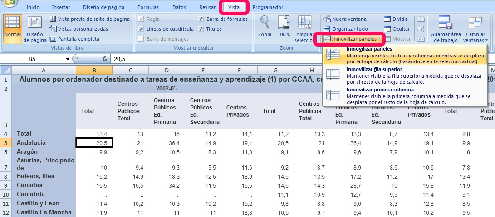

# U1. Herramientas que facilitan el trabajo

**Inmovilizar filas y/o columnas**

Con esta herramienta logramos dejar **fijas** filas y/o columnas, de forma que al desplazarnos hacia abajo o hacia la derecha no cambian aunque recorramos más de una pantalla.

Los pasos necesarios para conseguirlo son los siguientes:

1. Situar el cursor en la celda situada por debajo \(si queremos inmovilizar filas\) y/o a la derecha \(si queremos inmovilizar columnas\) de la última fila o columna que queremos que quede bloqueada. Es decir, quedará bloqueado todo lo que esté situado a la izquierda o por encima de la celda donde esté el cursor.

2. Accede a la opción de inmovilizar paneles. El modo de seleccionar esta opción cambia en los distintos programas:

   * En cualquier versión de [Excel](http://office.microsoft.com/es-es/excel-help/inmovilizar-o-bloquear-filas-y-columnas-HP001217048.aspx), tienes que acceder al **menú Vista** --- **Ventana** --- **Inmovilizar paneles**

     

   * En [Calc](http://wiki.open-office.es/Fijar_paneles_en_OpenOffice_Calc), hay que seleccionar el **menú Ventana** --- **Fijar**

   * En [Drive](https://support.google.com/drive/answer/54813?hl=es), debes acceder al **menú Ver** --- **Inmovilizar**

> **tip**
>
> ## Caso práctico
>
> Partiendo del archivo visto en la introducción del módulo 4, [hoja de cálculo](http://aularagon.catedu.es/materialesaularagon2013/hojacalc/datos.xls), inmoviliza paneles para lograr moverte sin dificultad por toda la hoja sin perder de vista los encabezados de fila y columna.
>
> %accordion%Solución%accordion%
>
> Tienes que situarte en la celda **B4** para fijar tanto las filas como las columnas anteriores.
>
> %/accordion%

**Filtrar y ordenar datos**

Cuando la base de datos con la que trabajamos es muy grande, resulta muy incómodo movernos por las celdas para encontrar datos específicos. La tarea se facilita si utilizamos estas dos herramientas de las hojas de cálculo:

* Utilizamos **filtrar**, cuando pretendemos elegir un conjunto de datos que cumpla unos criterios específicos, dentro de la base de datos completa.

* Usamos **ordenar**, cuando queremos obtener ordenados los datos de nuestra hoja de cálculo, atendiendo al criterio que especifiquemos: orden creciente o decreciente, alfabético, varios criterios...

En los siguientes enlaces puedes consultar la manera de realizar estas dos operaciones en los distintos programas:

[Filtrar ](http://office.microsoft.com/es-es/excel-help/filtrar-datos-de-un-rango-o-una-tabla-HP010073941.aspx)y [ordenar ](http://office.microsoft.com/es-es/excel-help/ordenar-datos-en-un-rango-o-tabla-HP010073947.aspx) datos en Excel 2007

[Filtrar ](http://office.microsoft.com/es-es/excel-help/filtrar-datos-de-un-rango-o-una-tabla-HP010342517.aspx)y [ordenar ](http://office.microsoft.com/es-es/excel-help/tareas-basicas-en-excel-2010-HA101829993.aspx#_Toc256078355) datos en Excel 2010

[Filtrar ](http://wiki.open-office.es/Filtrar_celdas_en_OpenOffice_Calc)y [ordenar ](http://wiki.open-office.es/Ordenar_datos_en_OpenOffice_Calc) en Apache OpenOffice Calc

[Filtrar y ordenar](https://support.google.com/drive/answer/1272909?hl=es)  datos en Google Drive

> **tip**
>
> ## Caso práctico
>
> Partiendo del archivo [Empresa](http://aularagon.catedu.es/materialesaularagon2013/hojacalc/empresa.xls), realiza las siguientes acciones:
>
> 1. Ordena los datos por orden alfabético del apellido, ¿quién es el primero y el último?
> 2. Ordena de mayor a menor sueldo, ¿quién es el primero y el último?
> 3. Aplica un filtro para visualizar el personal que trabaja en el departamento de dirección, ¿cuántos son?
> 4. Aplica un filtro que permita ver los empleados cuyo sueldo oscile entre 1200 y 2000 euros, ¿cuántos son?
> 5. Aplica un filtro que muestre los empleados que trabajen en el departamento de comercial y ganen más de 1200 euros ¿cuántos son?
>
> %accordion%Solución%accordion%
>
> 1. Son el 4 y el 1
> 2. Son el 1 y el 3
> 3. Son 3 personas
> 4. Son 8 personas
> 5. Son 4 personas
>
> %/accordion%

