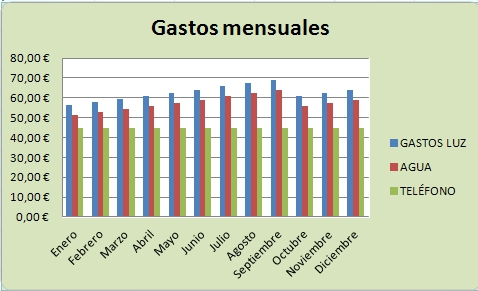
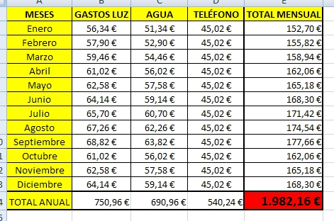
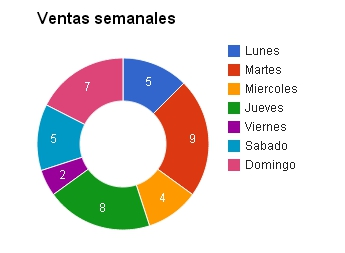

# U1. Hojas de cálculo

Una **hoja de cálculo** es un programa que permite realizar automáticamente cálculos con datos numéricos y alfanuméricos. Es decir, permite realizar operaciones aritméticas, estadísticas, lógicas...

El mayor potencial que presenta esta aplicación es que utiliza fórmulas que pueden mover cientos de miles de datos numéricos, lo que conlleva un considerable ahorro tanto en tiempo como en esfuerzo, a la vez que disminuye posibles errores cometidos por repetición reiterada de operaciones.

Otra ventaja que muestran este tipo de programas es que permiten actualizar o modificar los datos sin necesidad de volver a realizar los cálculos, ya que se recalculan automáticamente.

 

¿Qué otras ventajas presentan?

- Permiten organizar y ordenar los datos atendiendo a distintos criterios.

- Ofrecen facilidad de uso, ya que se desarrollan en un entorno visual agradable, con un diseño intuitivo y de fácil acceso.

- Disponen de elementos gráficos, que ayudan a interpretar y presentar los resultados.

- Consiguen una presentacion vistosa y clara, adaptada a las distintas necesidades, de una manera sencilla.

- Pueden interactuar con bases de datos para rellenar los campos de referencia, automatizando la fase de creacion de las hojas de cálculo.

- Al estar integrados con paquetes de procesadores de textos y de presentaciones, facilitan la realización de informes, análisis, etc.

> **tip**
>## Para Saber Mas

>La primera aplicación de hoja de cálculo para un ordenador fue VisiCalc desarrollada por Dan Bricklin en 1979. La idea surgió al ver a su profesor borrar y recalcular un montón de datos secuenciales en la pizarra, cada vez que quería cambiar alguna condición del problema o cometía algún error.

>Esta primera aplicación solamente contaba con cinco columnas y veinte filas, nada que ver con las dieciseismil filas y más de un millón de columnas que tiene la última versión de Microsoft Excel.

