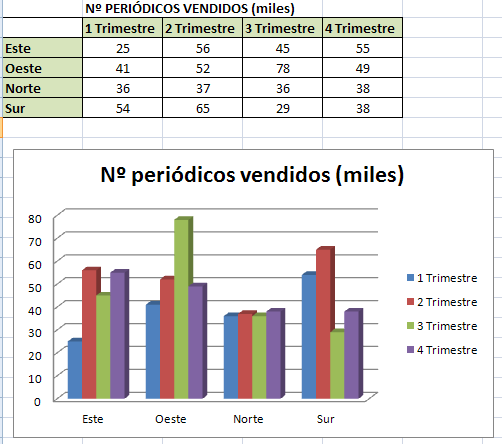
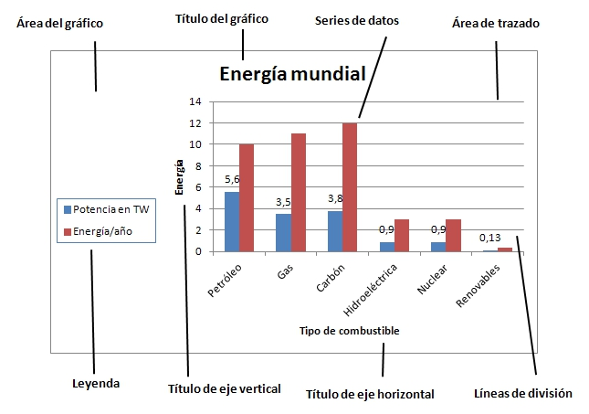

# U1. Partes de un gráfico

** **

Un gráfico es la representación gráfica de los datos de una hoja de cálculo, con la enorme ventaja de que, si estos datos cambian, el gráfico se actualiza automáticamente. 

Los gráficos comunican visualmente las relaciones entre los datos, resumen la información y la transforman en resultados más sencillos e inmediatos.

Un gráfico se puede presentar en la misma hoja de trabajo, con la que podemos conseguir trabajos vistosos con datos numéricos y gráficos a la vez, o en una hoja distinta para obtener los resultados de manera exclusivamente visual.

 

|**Figura 3_3: Captura de pantalla propia. Ejemplo de gráfico**

En todos los gráficos que creamos, independientemente del programa utilizado, aparecen una serie de elementos comunes que pasamos a describir a continuación:

 

- **Leyenda**: es el cuadro que identifica los diseños o colores asignados a las series de datos o categorías.

- **Título del gráfico**: es un texto descriptivo del gráfico que se coloca en la parte superior.

- **Ejes**: son dos líneas perpendiculares que sirven como referencia para trazar el gráfico. Al eje horizontal se le llama eje de abcisas o eje X, y al eje vertical, se le denomina eje de ordenadas o eje Y.

- **Título de los ejes**: son textos descriptivos de cada uno de los ejes.

- **Líneas de división**. Son líneas opcionales que extienden los valores de los ejes de manera que faciliten su lectura e interpretación.

- **Series de datos**: son los puntos de datos relacionados entre sí trazados en un gráfico. Cada serie de datos tiene un color exclusivo. Un gráfico puede tener una o más series de datos a excepción de los gráficos circulares que solamente pueden tener una serie de datos.

- **Puntos de datos**: son símbolos dentro del gráfico que representan a una celda de la tabla de datos

- **Área de trazado**: es el área sobre el que aparece el gráfico.Incluye todos los ejes y los marcadores de datos y sobre él se sitúan las líneas de división.

- **Área del gráfico**: es el conjunto del gráfico e incluye todas sus partes.

 

|**Figura 3_4: Captura de pantalla propia. Partes de un gráfico**

 

 

 

 

# Rellenar huecos

Lea el párrafo que aparece abajo y complete las palabras que faltan.

 

En un gráfico se distinguen claramente dos áreas: el área que contiene solamente el gráfico se denomina 
<label class="sr-av" for="clozeBlank14_21.0">Rellenar huecos (1):</label>
<input class="autocomplete-off" id="clozeBlank14_21.0" onkeyup="$exe.cloze.change(this)" style="width:15em" type="text" value=""/>
JXUwMGI5JXUwMDkzJXUwMDE3JXUwMDA0JXUwMDQxJXUwMDQ0JXUwMDAxJXUwMDQ1JXUwMDU0JXUw
MDA2JXUwMDEzJXUwMDFiJXUwMDFiJXUwMDA1JXUwMDBi

, mientras que el área que contiene a la anterior más todas sus partes se llama 
<label class="sr-av" for="clozeBlank14_21.1">Rellenar huecos (2):</label>
<input class="autocomplete-off" id="clozeBlank14_21.1" onkeyup="$exe.cloze.change(this)" style="width:16em" type="text" value=""/>
JXUwMGI5JXUwMDkzJXUwMDE3JXUwMDA0JXUwMDQxJXUwMDQ0JXUwMDAxJXUwMDA5JXUwMDRjJXUw
MDQ3JXUwMDE1JXUwMDkzJXUwMDg3JXUwMDBmJXUwMDBhJXUwMDBj

.

El texto que define el eje horizontal se llama 
<label class="sr-av" for="clozeBlank14_21.2">Rellenar huecos (3):</label>
<input class="autocomplete-off" id="clozeBlank14_21.2" onkeyup="$exe.cloze.change(this)" style="width:25em" type="text" value=""/>
JXUwMDJjJXUwMDk5JXUwMDk5JXUwMDAxJXUwMDE5JXUwMDAzJXUwMDRmJXUwMDQ0JXUwMDAxJXUw
MDA5JXUwMDRjJXUwMDQ1JXUwMDBmJXUwMDBmJXUwMDQ1JXUwMDQ4JXUwMDA3JXUwMDFkJXUwMDFi
JXUwMDEzJXUwMDE1JXUwMDAxJXUwMDFhJXUwMDE1JXUwMDBk

.

La 
<label class="sr-av" for="clozeBlank14_21.3">Rellenar huecos (4):</label>
<input class="autocomplete-off" id="clozeBlank14_21.3" onkeyup="$exe.cloze.change(this)" style="width:7em" type="text" value=""/>
JXUwMDM0JXUwMDA5JXUwMDFjJXUwMDFjJXUwMDBiJXUwMDBhJXUwMDA1

 es lo que nos ayuda a entender el gráfico y lo que nos explica a qué corresponde cada parte del gráfico.

Cada 
<label class="sr-av" for="clozeBlank14_21.4">Rellenar huecos (5):</label>
<input class="autocomplete-off" id="clozeBlank14_21.4" onkeyup="$exe.cloze.change(this)" style="width:5em" type="text" value=""/>
JXUwMDJiJXUwMDE2JXUwMDE3JXUwMDFiJXUwMDBj

 de datos tiene un color exclusivo para que sea más sencilla su interpretación.

 

<input id="getScore14_21" onclick="$exe.cloze.showScore('14_21')" type="button" value="Averiguar la puntuación"/>
<input id="showAnswersButton14_21" name="14_21showAnswersButton" onclick="$exe.cloze.toggleAnswers('14_21')" style="" type="button" value="Mostrar/Eliminar las respuestas"/>
Habilitar JavaScript

