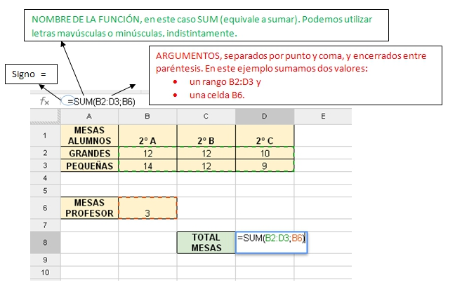
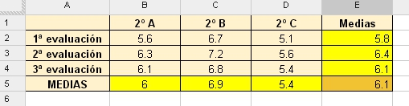

# U1. Sintaxis de una función

Ya hemos dicho en la introducción del módulo que las fórmulas más simples se suelen introducir manualmente.

Sin embargo, cuando la dificultad aumenta, se suelen utilizar **Funciones **que facilitan el proceso.

Una **Función **es una expresión que introducimos en una celda y que relaciona valores y fórmulas de otras celdas para producir un resultado.  Una fórmula comienza siempre con el signo igual (**=**) y puede contener textos, números, referencias de celdas...

Independientemente del programa que estemos utilizando, el formato de una función en la barra de fórmulas es el siguiente:

 
<td style="text-align: center;">**=FUNCION(Argumento1;Argumento2;….)**</td>

 

 

donde:

- **Signo **= ****(lo añadimos para indicar al programa que vamos a escribir una función y no un dato)

<li>**Función** es la fórmula que necesitamos en cada caso (sumar, mediar, etc). Aunque la mayoría de las operaciones son iguales en todos los programas, si que cambia el nombre de la función asociada. Por ejemplo, para realizar la operación MEDIA ARITMÉTICA, se utilizan las siguientes funciones dependiendo del programa utilizado:
<ul>
- =PROMEDIO en Excel
- =PROMEDIO en Calc
- =AVERAGE en Drive

- **Argumentos** son los datos necesarios encerrados entre paréntesis (celdas o rangos).      

 

Veamos un ejemplo:

|**Figura 2_02:Captura de pantalla propia. Sintaxis de una función**

 

En la celda que contiene la fórmula se visualiza siempre el resultado de la misma y la fórmula en sí se visualiza en la barra de fórmulas.

Además, aparece asociado cada argumento a un color, con lo que es más sencillo comprobar si la ecuación es correcta. En este ejemplo aparece el rango **B2:D3** en verde y la celda **B6** en rojo.

Los resultados de las funciones, al igual que el de las fórmulas, se actualizan automáticamente al modificar los datos de las celdas cuyas direcciones son referenciadas en la función.

# Caso práctico

En la siguiente tarea vamos a practicar con los siguientes conceptos:

- Insertar datos
- Cambiar formato
- Introducir fórmula

En una hoja de cálculo del programa que decidas, introduce los siguientes datos:
| |2º A|2º B|2º C
|1ª Evaluación|5,6|6,7|5,1
|2ª Evaluación|6,3|7,2|5,6
|3ª Evaluación|6,1|6,8|5,4
|Evaluación Final| | | 

Añade las fórmulas necesarias para calcular las notas medias de la evaluación final para cada clase y además añade una columna a la derecha con las notas medias por evaluación.

<input class="feedbackbutton" name="toggle-feedback-quesFeedback0b42" onclick="$exe.toggleFeedback(this,true);return false" type="button" value="Mostrar retroalimentación"/>

# Retroalimentación

