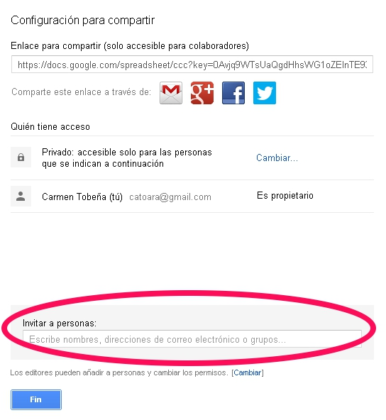
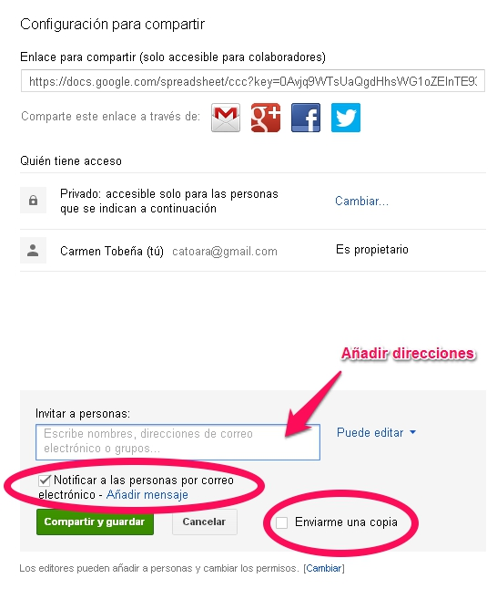
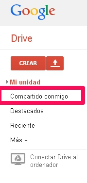

# U2: Compartir archivos

Como has podido observar a lo largo del curso, el uso de Google Drive es intuitivo y sencillo, solamente necesitas tener una cuenta gratuita de Google (que incluye correo Gmail, Drive...)

La opción de **compartir** que aparece en los archivos creados con Drive, te permite ver los archivos y las carpetas que otros han compartido contigo. Puedes ver la última modificación, además de las marcas horarias (donde se registra la última vez que un colaborador ha guardado algo), el nombre del propietario del archivo o la carpeta y los elementos no vistos (que aparecen en negrita).

### ¿Cómo se comparte un archivo o carpeta?

Muy sencillo, solamente tienes que abrirlo y hacer clic sobre la opción Compartir  que aparece en la parte superior derecha.

Una vez hecho esto, aparece un menú, como el que se muestra en la figura. En la parte inferior aparece un cuadro donde podemos añadir las direcciones de correo electrónico o grupos de las personas que queremos invitar a compartir el archivo o carpeta.

 

Al introducir las direcciones aparecen dos casillas de verificación:

* Una que permite notificar a las personas que hemos invitado, por correo electrónico, que hemos compartido con ellas un archivo o carpeta. Permite además añadir texto personalizado al mensaje.
 
* Otra opción  permite enviarnos una copia a nosotros mismos.
 
Por último elegiremos Compartir y guardar.

 

Para acceder a los documentos que otras personas han compartido con nosotros, hemos de acceder desde el menú inicial de Drive, la elegir la opción **Compartido conmigo** del menú de la izquierda, como se muestra en la Figura 5_05.

>**danger**
>
># Importante
>
>En **Archivo** --- ****Ver historial de revisión****, puedes acceder al control de cambios en el documento.
>
>Permite obtener información sobre quién ha hecho las modificaciones, en qué fecha y hora han sido hechas, y cómo estaba el documento en ese momento.
>
>Te permite además restaurar cualquiera de los estados anteriores.

___

>**tip**
># Para Saber Más
>
>Otra posibilidad para compartir archivos es utilizar un servicio de alojamiento multiplataforma en la nube, como es el caso de [Dropbox](https://www.dropbox.com/), [Box](https://app.box.com/) o [SkyDrive](https://login.live.com/login.srf?wa=wsignin1.0&amp;rpsnv=11&amp;ct=1384887556&amp;rver=6.2.6289.0&amp;wp=MBI_SSL_SHARED&amp;wreply=https:%2F%2Fskydrive.live.com%2F%3Fmkt%3Des-ES&amp;lc=3082&amp;id=250206&amp;cbcxt=sky&amp;mkt=es-ES&amp;cbcxt=sky).
>
>Estos servicios permiten a los usuarios almacenar y sincronizar archivos en línea y entre ordenadores y compartir archivos y carpetas con otros.   
>
>Si quieres saber más sobre el uso de algunos de estos servicios puedes acceder a los siguientes enlaces de FacilyTic, donde hay tutoriales de [Dropbox  ](http://www.catedu.es/facilytic/2013/05/16/dropbox/)y de [Box](http://www.catedu.es/facilytic/2013/10/10/896/).

