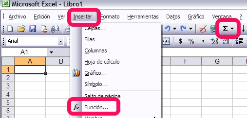
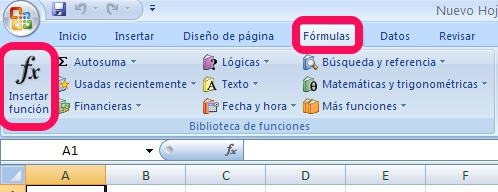
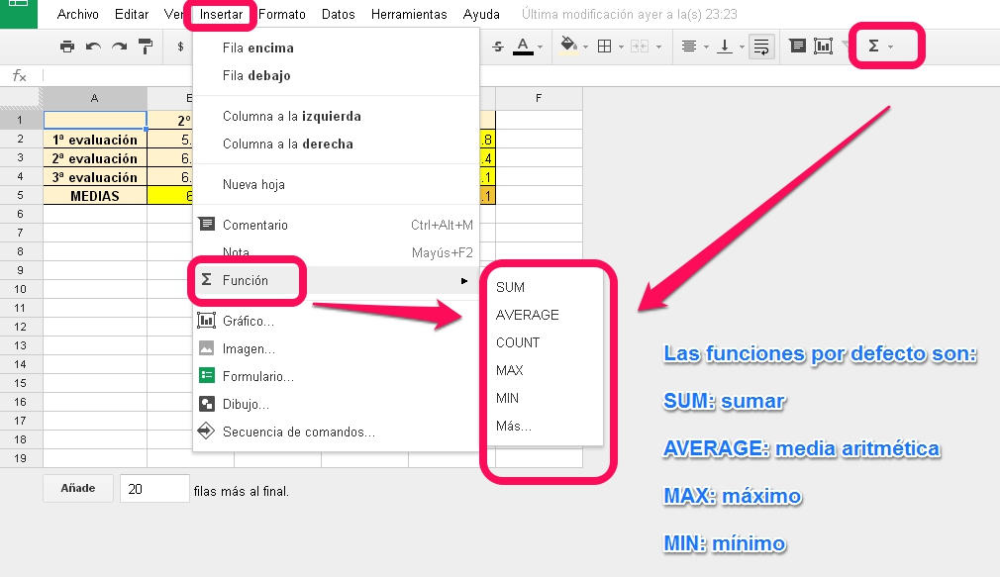

# U2. Funciones

Todos los programas que estamos tratando incluyen una enorme cantidad de funciones agrupadas por categorías.

En todos ellos la manera de acceder a esas funciones es la misma:

1. Situarnos en la celda donde queremos obtener el resultado
1. Hacer clic sobre el icono de ****Insertar Función****. Lo único que cambia es la forma que tiene este icono en los tres programas, que es lo que vamos a ver a continuación.

- En las versiones de **Microsoft** **Excel**, la pantalla tiene este aspecto:

 

<td colspan="2"> **Figura 2_06: Captura de pantalla propia. Insertar función en Excel 2003 **</td>

<td colspan="2" style="text-align: right;">**Figura 2_07: Captura de pantalla propia. Insertar función en Excel 2007 y 2010 **</td>

 

- En **Calc de OpenOffice**: puedes ver esta información en el siguiente [enlace](http://wiki.open-office.es/El_Asistente_de_funciones_en_Calc).

 

 

- En **Drive de Google** ocurre exactamente lo mismo que en la versión 2003 de Excel. Podemos acceder desde el menú **Insertar -- Función**, o desde la barra de herramientas a través del icono **Σ**. La pantalla que aparece tiene el siguiente aspecto:

|**Figura 2_8: Captura de pantalla propia. Insertar función en Google Drive**

# Importante

Para obtener un listado de todas las funciones disponibles en cada programa puedes acceder a los siguientes enlaces:

- Para [Microsoft Excel 2003 y 2007](http://office.microsoft.com/es-es/excel-help/lista-de-funciones-de-hoja-de-calculo-por-categoria-HP010079186.aspx) 

- Para [Microsoft Excel 2010](http://office.microsoft.com/es-es/excel-help/funciones-de-excel-por-categoria-HP010342656.aspx)

- Para [Calc de Apache OpenOffice](http://wiki.openoffice.org/wiki/ES/Traduccion/Calc/Funciones)

- Para [Drive de Google](https://support.google.com/drive/table/25273?hl=es)

# ParaSaberMas

La mayor parte de las funciones aparecen en los tres programas tratados en el curso.

Sin embargo **Google Drive** presenta algunas excepciones como son:

- **=Googletranslate** para traducir textos;

- **=image()** para insertar imágenes adaptadas al tamaño real de la celda

