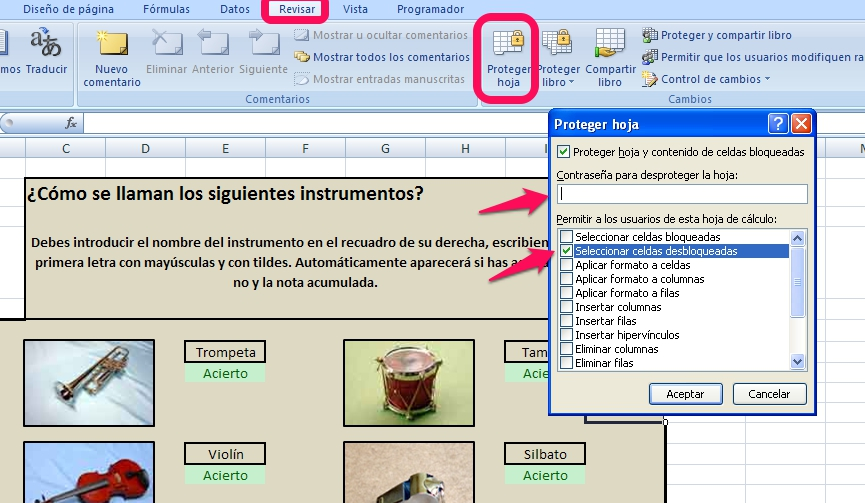

# U2. Herramientas para presentar los resultados

**Proteger total o parcialmente una hoja de cálculo**

 

Cuando realizamos hojas de cálculo para que nuestros alumnos trabajen con ellas en clase, nos interesa que solamente puedan acceder a una parte de la misma, la parte en la que introducen las respuestas, pero no a las celdas en las que tenemos las funciones que hacen que la hoja funcione correctamente.

Vamos a rescatar una de las prácticas vista en los primeros módulos: la del juego de aciertos de los instrumentos de música, ¿la recuerdas?

Puedes descargarla desde [aquí](http://aularagon.catedu.es/materialesaularagon2013/hojacalc/icos_musica.xlsx). Al entrar verás que los únicos campos que puedes modificar son los recuadros donde se introduce el nombre de los instrumentos. Al ir escribiendo respuestas aparece automáticamente si has acertado o no y la nota que acumulas en ese momento, pero en el resto de casillas no puedes entrar, ni siquiera seleccionarlas para ver las fórmulas usadas. 

Los pasos a seguir, si utilizas los programas **Excel o Calc**  son los siguientes:

- **PASO 1: Marcar las celdas que no queremos proteger**. Vamos a seleccionar todas las celdas o rangos que queremos que **sí** puedan modificarse al utilizar la hoja. Después desde el botón derecho del ratón, accederemos al menú de **Formato de celdas **y desde allí entramos en la pestaña** Proteger **(si utilizamos Excel) o** Protección de ****celdas** (si usamos Calc). Por defecto todas las celdas tienen activada la opción **Protegido **o **Bloqueada**, que es lo que hemos de cambiar en este caso.

 

- **PASO 2: Activar la protección de la hoja**. Desde el menú **Revisar** --- **Proteger hoja** (si estás en Excel) o desde el menú **Herramientas** --- **Proteger documento** ---**Hoja **(si usas Calc). En el menú que aparece permite seleccionar las acciones que se va a permitir que realicen los usuarios, así como la contraseña utilizada.

|**Figura 4_02: Captura de pantalla propia. Proteger hoja**

 

 Para saber más sobre esta herramienta, puedes consultar los siguientes enlaces:

<td style="text-align: center;">[Excel 2007](http://support.microsoft.com/kb/973079/es)</td>
<td style="text-align: center;">[Excel 2010](http://office.microsoft.com/es-es/excel-help/proteger-documentos-libros-o-presentaciones-con-contrasenas-permisos-y-otras-restricciones-HA010354324.aspx)</td>
<td style="text-align: center;">[Calc](http://wiki.open-office.es/Proteger_hojas_en_Calc)</td>

 

En **Drive** la cosa cambia. Las primeras versiones de este programa solamente contenían la opción de proteger toda la hoja. Si desde la hoja en la que estés trabajando despliegas el menú inferior que acompaña al nombre de la hoja (Sheet 1...) una de las opciones que aparece es **Proteger Hoja**. Al entrar, te permite cambiar **quién tiene permiso para modificar la hoja**: cualquier persona, solo yo o colaboradores.

Sin embargo, a partir del 2012 se añadió la posibilidad de proteger celdas por separado. A esta opción se le denomina **Intervalos con nombre y protegidos** y puedes acceder desde el menú **Datos**. Accede [aquí ](https://support.google.com/drive/answer/63175?hl=es) para saber más.

 

## ParaSaberMas

Una de las opciones que nos permite el programa **Calc**, es ocultar una serie de celdas para la impresión. De esta manera, tras proteger la hoja, no se imprimirían las celdas marcadas o no se exportarán a documentos en formato pdf, aunque si se verán en pantalla.

Se accede a esta opción en el mismo lugar que para proteger hoja.

