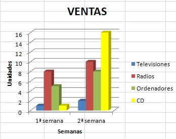
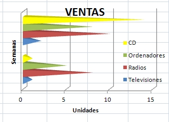
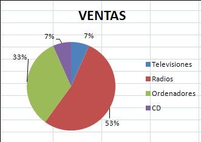
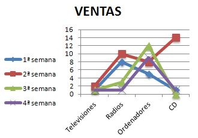
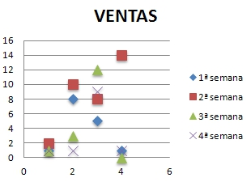
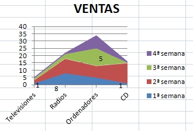
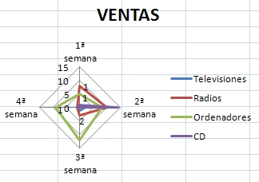
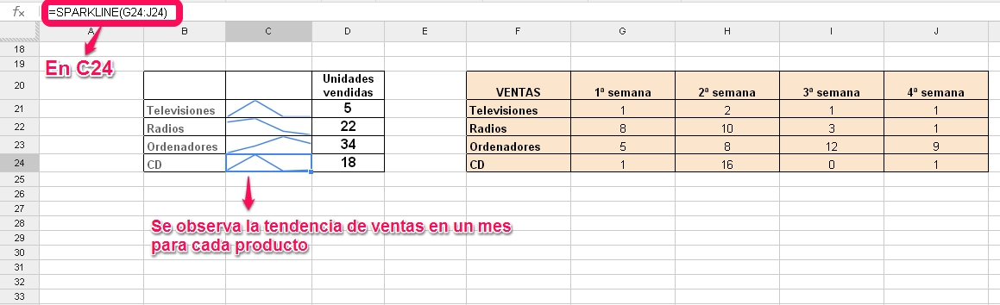
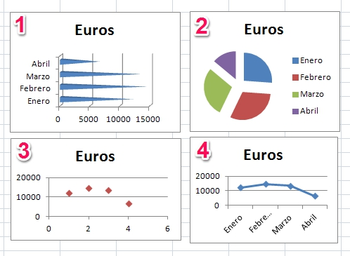

# U2. Tipos de gráficos

Vamos a describir a continuación los **tipos de gráficos** más habituales, y que son comunes a todos los programas tratados en este curso. En todos ellos los datos en la hoja de cálculo pueden estar dados en filas o columnas, y dentro de cada categoría existen diversas posibilidades o subcategorías.

___
## GRÁFICO DE COLUMNAS

Es un gráfico formado por barras verticales proporcionales a su valor.

Es útil para **comparar entre datos**.

Normalmente las categorías se sitúan en el eje horizontal y los valores en el eje vertical.

Como subcategorías destacan: normal, apilados, con forma de cono, de pirámide, en 3D...

___
## GRÁFICO DE BARRAS 

Es un gráfico formado por barras horizontales proporcionales a su valor.

Es útil para **comparar entre datos**.

Normalmente las categorías se sitúan en el eje vertical y los valores en el eje horizontal, y se utiliza cuando las etiquetas de eje son largas, para que de esta manera no se tapen entre ellas.

Como subcategorías destacan: normal, apilados, con forma de cono, de pirámide, en 3D...

___
## GRÁFICO CIRCULAR

Es un gráfico con sectores circulares donde el área de cada sector es proporcional a su valor y la suma de todos es el total del círculo.

Es útil para **comparar la relación entre los datos y el total**, ya que muestra el tanto por ciento que representa un dato respecto al total.

Podemos elegir entre normal o 3D, sectores unidos o separados...

___
## GRÁFICO DE LÍNEAS

Es un gráfico de puntos que pueden estar conectados ente sí mediante líneas.

Es útil para **representar tendencias de varias series de datos a intervalos iguales**.

En el eje horizontal se muestran las categorías, y en el eje vertical los valores de cada categoría.

Podemos elegir entre: solo puntos, solo líneas, puntos y líneas...

___
## GRÁFICO DE DISPERSIÓN

Es un gráfico que muestra una serie de coordenadas XY, es decir, la relación entre dos variables.

Los datos en la hoja de cálculo pueden estar dados en filas o columnas.

Es útil para **mostrar y comparar valores numéricos de varias series de datos**.

El nombre de la serie de datos es asociado con los valores Y, y se muestran en la leyenda.

Podemos elegir entre: solo puntos, solo líneas, puntos y líneas...

___
## GRÁFICO DE ÁREAS

Es un gráfico que muestra una serie como un conjunto de puntos conectados por una línea, y con toda el área rellenada por debajo de la línea. Muestra los totales para todas las series y la proporción con la que cada serie contribuye al total.

Es útil para **resaltar el valor total en una tendencia**.

En el eje horizontal se muestran las categorías, y en el eje vertical los valores de cada categoría.

Podemos elegir entre: normal, apilado, 3D...

___
## GRÁFICOS RADIALES O DE RED

Es un gráfico que presenta los valores como puntos conectados por varias líneas formando una tela de araña.

Es útil para comparar datos.

Utiliza la circunferencia del gráfico como eje X.

Podemos elegir entre: solo puntos, solo líneas, puntos y líneas...

___

Además de las categorías anteriores, existen otros tipos de gráficos que no son iguales en todos los programas. 

Para conocer todas las posibilidades de cada programa, puedes acceder a los siguientes enlaces:

- Todos los tipos de gráficos en [Excel 2007](http://office.microsoft.com/es-es/excel-help/tipos-de-graficos-disponibles-HA001233737.aspx#BMothercharts)

- Todos los tipos de gráficos en [Excel 2010](http://office.microsoft.com/es-es/excel-help/tipos-de-graficos-disponibles-HA010342187.aspx)

- Todos los tipos de gráficos en [Calc](http://wiki.open-office.es/Tipos_de_graficos_en_OpenOffice_Calc)

- Todos los tipos de gráficos en [Drive](https://support.google.com/drive/topic/30240)

>**success**
>
># Para Saber Más
>
>En  **Drive de Google** existe un tipo específico de gráficos que se denomina **Minigráfico**, que es parecido a un gráfico de líneas, pero muestra líneas de datos en distintos ejes apilados. 

>Pero OJO, es importante, no confundirlos con los minigráficos de Excel.

>A partir de la versión 2010 de Excel podemos representar en una celda la tendencia de una serie de datos, mediante la inserción de un minigráfico. Los **minigráficos** no son tipos de gráfico, es decir, no son objetos, sino fondos en las celdas. 

>En **Excel 2010** puedes acceder desde el menú **Insertar** -- **Minigráficos** y una vez dentro elegir entre **Línea**, **Columna** o **Ganancia y pérdida**. Si quieres saber más sobre el tema visita el siguiente [enlace](http://office.microsoft.com/es-es/excel-help/usar-minigraficos-para-mostrar-tendencias-de-datos-HA010354892.aspx).

>En **Drive** existe otra opción para realizar estos minigráficos de Excel, y es utilizando la función **=SPARKLINE**, como puedes observar en el siguiente ejemplo:

>

>Dada la utilidad que nos puede aportar esta función, es posible descargar extensiones de **sparkline** tanto para versiones anteriores de Excel (2003 y 2007) como para Calc de Apache OpenOffice.

# Rellenar huecos

Observa los siguientes gráficos e identifica cada uno rellenando el texto inferior


El gráfico es 1 es un tipo de gráfico de $$barras## y subtipo $$cono horizontal agrupado##.

El gráfico 2 es un tipo de gráfico $$circular## de subtipo $$seleccionado##.

El gráfico 3 utiliza un tipo de gráfico $$XY## $$dispersión## de subtipo $$dispersión solo con marcadores##.

La representación 4 es un tipo de gráfico de $$línea## de subtipo $$línea con marcadores##


>**success**
># Para Saber Más
>
>Uno de los gráficos más novedosos es el gráfico **mapas** de Drive de Google, que permite representar valores en un mapa de un país, continente o región. Utiliza colores asociados a la mayor o menor densidad directamente relacionada con el valor asignado a cada zona.
>
 

