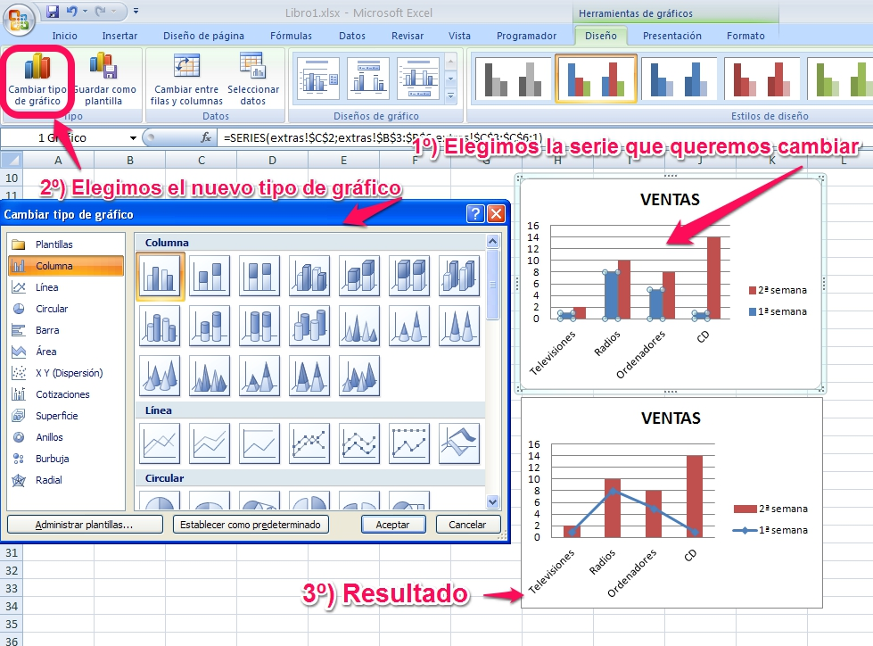
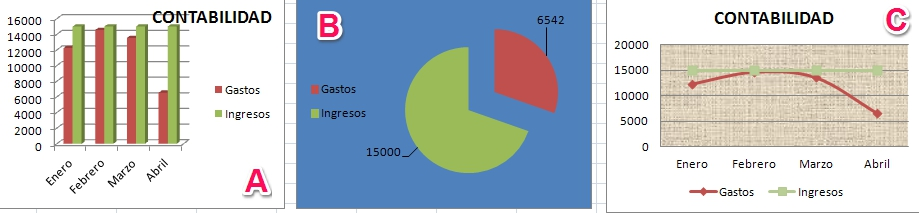

# U3. Crear y editar graficos

Para **crear un gráfico** hemos de partir siempre de unos datos representados en la hoja de cálculo. Estos datos pueden disponerse en la misma hoja que el gráfico, o en una hoja independiente.

Normalmente en un gráfico pueden representarse los datos dispuestos en las filas o en las columnas de la hoja de cálculo, aunque en ocasiones se necesita una disposición específica, como ocurre en los gráficos circulares.

Además, todos los programas vistos en este curso nos permiten **editar**, es decir cambiar el aspecto de los elementos que componen el gráfico. Es verdad que el programa con mayores posibilidades es Excel, pero cualquiera de los tres resulta suficiente para nuestro trabajo diario.

A modo de ejemplo vamos a tratar aquí la manera de crear un gráfico y las posibilidades que nos ofrece el programa **Excel 2007**, pero vas a poder consultar en los siguientes enlaces la forma de crear y editar los gráficos en el resto de programas.

 
<table>
  <tr>
    <td>Microsoft Excel 2010</td>
    <td colspan="2"><a href="http://office.microsoft.com/es-hn/excel-help/como-crear-un-grafico-basico-en-excel-2010-RZ102559017.aspx">Crear y editar gráfico</a></td>
  </tr>
  <tr>
    <td>Calc de Apache OpenOffice</td>
    <td><a href="http://wiki.open-office.es/Insertar_un_grafico_en_cinco_sencillos_pasos_en_OpenOffice_Calc">Crear gráfico</a></td>
    <td><a href="http://wiki.open-office.es/Modificar_un_grafico_en_OpenOffice_Calc">Editar gráfico</a></td>
  </tr>
  <tr>
    <td>Google Drive</td>
    <td><a href="https://support.google.com/drive/answer/63728?hl=es">Crear gráfico</a></td>
    <td><a href="https://support.google.com/drive/answer/63824?hl=es">Editar gráfico</a></td>
  </tr>
</table>

 
Para **Excel 2007 **puedes ver el siguiente [tutorial](http://aularagon.catedu.es/materialesaularagon2013/hojacalc/graficos.swf).

<object data="http://aularagon.catedu.es/materialesaularagon2013/hojacalc/graficos.swf" height="411" style="display: block; margin-left: auto; margin-right: auto;" type="application/x-shockwave-flash" width="822"><param name="src" value="http://aularagon.catedu.es/materialesaularagon2013/hojacalc/graficos.swf"/></object>

 
>**info**

># Importante
>
>Para obtener un gráfico es necesario que los datos de partida estén ordenados, es decir, agrupados y formando un rectángulo.
>
>Es muy importante no incluir en el rango de datos celdas vacías o combinadas.
>
>Recuerda que si queremos seleccionar celdas o rangos no consecutivos podemos hacerlo seleccionando la primera celda o rango de celdas y manteniendo presionada la tecla **CTRL** a la vez que selecciona las demás celdas o rangos.

___

>**success**

># Para Saber Más

>Se pueden obtener también **gráficos combinados** en aquellos casos en los que tengamos más de dos series de datos.

>Para conseguirlo, en **Excel** **2007/2010** partimos de un gráfico ya existente, elegimos una de las series (la que queramos cambiar) y le cambiamos el tipo de gráfico, como puedes ver a continuación.

> 

>En **Google Drive** los gráficos combinados aparecen directamente como una opción de tipo de gráfico.

>En **Calc y Excel 2003**, se puede elegir directamente en tipo de gráfico, pero solamente permite algunas opciones de combinación.

___

> **tip**

># Caso práctico

>A partir de los siguientes datos:
>
>|  Meses  | Gastos (euros) | Ingresos (euros) |
>|:-------:|:--------------:|:----------------:|
>|  Enero  |     12254      |      15000       |
>| Febrero |     14560      |      15000       |
>|  Marzo  |     13541      |      15000       |
>|  Abril  |      6542      |      15000       |
>
>**Representa** los datos de la tabla anterior de la siguiente forma:
>
>1. En un diagrama de **columnas en 3D** los gastos e ingresos mensuales. Las columnas de ingresos tienen que ser de color verde y las de gastos de color rojo. Aparecerá la leyenda a la derecha y un título que indique "CONTABILIDAD".
>1. En un diagrama de **sectores** representa los gastos e ingresos en el mes de abril. Debe aparecer la leyenda a la izquierda. Los gastos en rojo y los ingresos en verde, y el valor de cada uno. El formato del área del gráfico debe tener un color azul.
>1. En un diagrama de **línea con marcadores** representar los gastos e ingresos mensuales. Los gastos en color rojo y los ingresos en verde. Con título de gráfico CONTABILIDAD. Leyenda inferior y el área de trazado con textura.
>
>%accordion%Solución%accordion%
>
>
>
>%/accordion%

