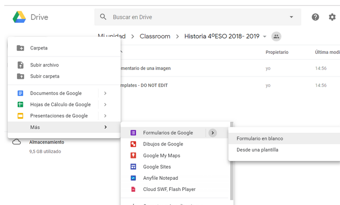
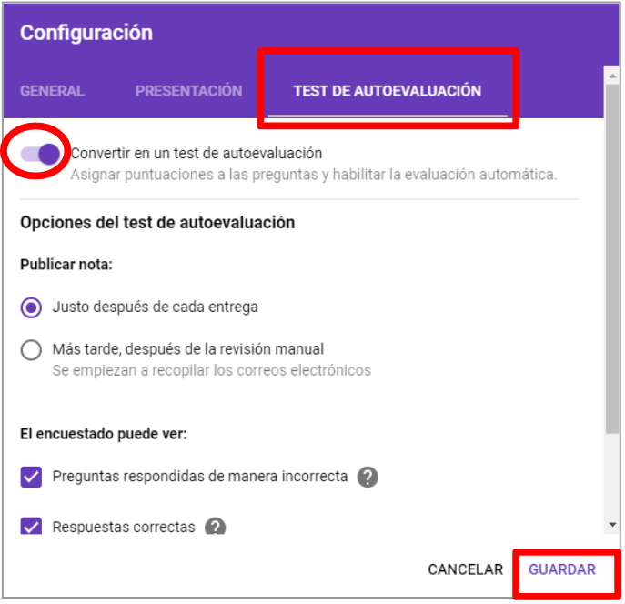
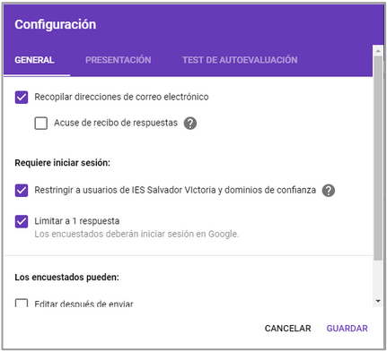
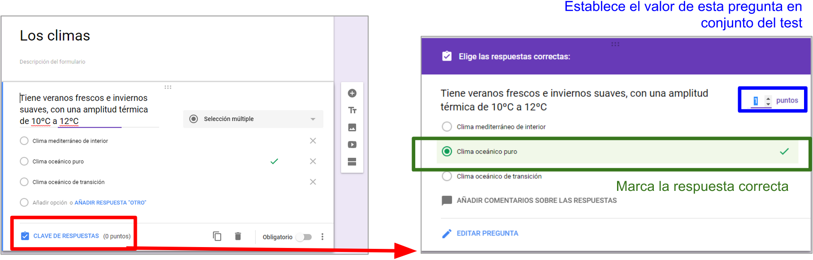
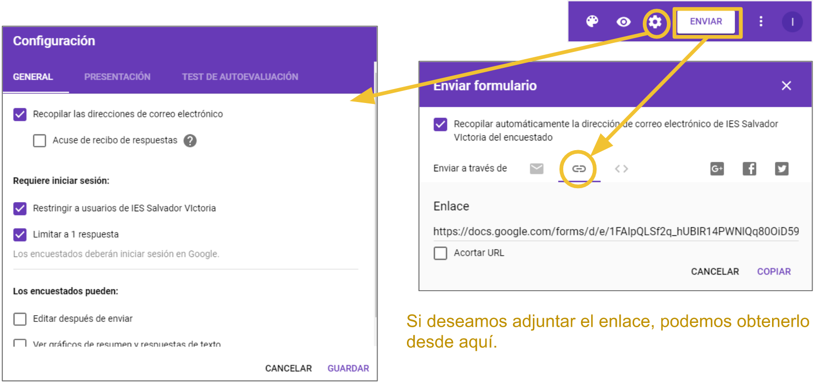

# U3: Formularios de Google Drive

Una de las utilidades con la que más nos encontramos al navegar por Internet son los formularios.

Un **formulario** es una plantilla incrustada en una página web con campos que los usuarios deben rellenar. Permite la captura de datos de manera rápida y sencilla. Además permite la posibilidad de enviarlos también por correo electrónico.

Observa el siguiente ejemplo de formulario montado dentro de un [blog](http://infocuarto2012.blogspot.com.es/2013/10/test-excel.html), utilizado para evaluar el conocimiento de los alumnos sobre hojas de cálculo.

Como has podido observar el ingreso de respuestas es muy sencillo, pues su elaboración también los es.

Para aprender a crear un formulario de Google, puedes visitar el siguiente enlace:

- [Página oficial de Google](https://support.google.com/drive/answer/87809?hl=es)

>**tip**
>
>## Para Saber Más
>
>En el mercado existen muchas herramientas que permiten crear formularios, entre las que destacamos las siguientes:
>
>- [Wufoo](http://www.wufoo.com/): es el formulario usado por marcas como Twitter. Ofrece muy buenas opciones pero es caro.
>
>- [FormSite](http://www.formsite.com/): ofrece alta calidad a bajo coste.
>
>- [FormAssembly](http://www.formassembly.com/): se basa en un sistema libre de diseño de formularios totalmente personalizables. Permite crear formularios gratuitos, pero también ofrece un plan tipo “pagas por lo que usas”. 
>
>- [FormStack](http://www.formstack.com/): se distingue por ofrecer integraciones de terceros con algunas de las aplicaciones web más intensamente utilizadas por pequeñas empresas. Solamente hay versión de prueba gratuita por 14 días.
>
>- [Gravity Forms](http://www.gravityforms.com/): Específicamente diseñado para ser utilizado dentro de WordPress. Ofrece un sistema de precios atractivo.

## Presentar e interpretar resultados

Una vez que se envían las respuestas, éstas se incorporan a una hoja de cálculo preparada para ello. Si a esta hoja de cálculo le hemos dado un formato adecuado, automáticamente aparecerán los resultados que buscamos: podemos saber la nota de cada estudiante, las estadísticas de las preguntas, gráficos asociados...

Utilizando los formularios de Google, cabe la posibilidad de plantear tareas con cuestiones de respuesta abierta o bien test autocorregibles. Para configurar un formulario como test debemos seleccionar esa opción en la configuración.

No olvides limitar la a 1 respuesta el envío de cada alumno.

Cuando hayas terminado de diseñar el examen, no ovlides especificar las respuestas correctas:

Por último, comparte el formulario/test con tu alumnado.

Todas las respuestas que recibas recibirán nota automáticamente en las preguntas previamente configuradas.

> **tip**
> 
> Para más información sobre el uso de cuestionarios de Google como tests y su integración con Google Classroom visita [este otro curso de Aularagón](https://catedu.github.io/google-classroom-2018/modulo_4_mas_alla_de_classroom/41_examenes_en_classroom.html).

----
