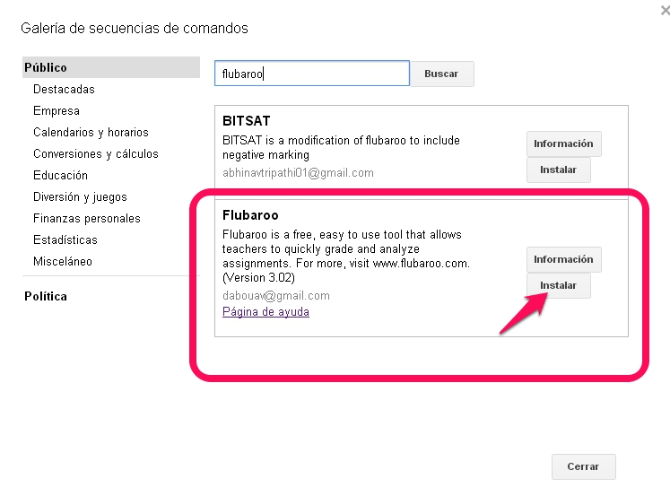

# U3: Formularios de Google Drive

Una de las utilidades con la que más nos encontramos al navegar por Internet son los formularios.

Un **formulario** es una plantilla incrustada en una página web con campos que los usuarios deben rellenar. Permite la captura de datos de manera rápida y sencilla. Además permite la posibilidad de enviarlos también por correo electrónico.

Observa el siguiente ejemplo de formulario montado dentro de un [blog](http://infocuarto2012.blogspot.com.es/2013/10/test-excel.html), utilizado para evaluar el conocimiento de los alumnos sobre hojas de cálculo.

Como has podido observar el ingreso de respuestas es muy sencillo, pues su elaboración también los es.

Para aprender a crear un formulario de Google, puedes visitar los siguientes enlaces:

 

- [Página oficial de Google](https://support.google.com/drive/answer/87809?hl=es)

- [Video tutorial](http://www.slideshare.net/cedecite/formularios-google-docs-11814496) creado por el CeDec

>**tip**
>
>## Para Saber Más
>
>En el mercado existen muchas herramientas que permiten crear formularios, entre las que destacamos las siguientes:
>
>- [Wufoo](http://www.wufoo.com/): es el formulario usado por marcas como Twitter. Ofrece muy buenas opciones pero es caro.
>
>- [FormSite](http://www.formsite.com/): ofrece alta calidad a bajo coste.
>
>- [FormAssembly](http://www.formassembly.com/): se basa en un sistema libre de diseño de formularios totalmente personalizables. Permite crear formularios gratuitos, pero también ofrece un plan tipo “pagas por lo que usas”. 
>
>- [FormStack](http://www.formstack.com/): se distingue por ofrecer integraciones de terceros con algunas de las aplicaciones web más intensamente utilizadas por pequeñas empresas. Solamente hay versión de prueba gratuita por 14 días.
>
>- [Gravity Forms](http://www.gravityforms.com/): Específicamente diseñado para ser utilizado dentro de WordPress. Ofrece un sistema de precios atractivo.

## Presentar e interpretar resultados

Una vez que se envían las respuestas, éstas se incorporan a una hoja de cálculo preparada para ello. Si a esta hoja de cálculo le hemos dado un formato adecuado, automáticamente aparecerán los resultados que buscamos: podemos saber la nota de cada estudiante, las estadísticas de las preguntas, gráficos asociados...

Sin embargo, existen en el mercado herramientas que preparan esos datos automáticamente, es el caso del recurso gratuito **Flubaroo**,** **una herramienta que permite calificar de manera automática exámenes realizados a través de un formulario de Google Drive.

A continuación vamos a describir los pasos que tenemos que seguir para utilizarlo:

**PASO 1. Crear formulario**: como hemos aprendido en el punto anterior.

**PASO 2. Introducir las respuestas correctas**: accediendo a través de la opción **Ver el formulario publicado. **No hay que olvidar identificarnos correctamente, ya que estas respuestas nos servirán para compararlas con las de los alumnos.

 

**PASO 3. Compartir el formulario**: a través de correo electrónico (enviando la URL que aparece al activar **Ver el formulario publicado**) o en un sitio Web (para conocer el código HTML asociado, debes acceder al menú **Archivo** --- **Insertar**, y copiar y pegar el código mostrado).

**PASO 4. Instalar Flubaroo:** accediendo al menú **Insertar** --- **Secuencia de comandos**, y eligiendo en la pantalla que aparece la opción **Flubaroo**, como puede observarse en las imágenes inferiores.

Para que la aplicación funcione correctamente, la hoja de cálculo asociada a los resultados (desde donde instalamos Flubaroo) debe renombrarse como “Student Submissions” (que podría traducirse como envíos o respuestas de los estudiantes).

El aspecto de la hoja de cálculo tras recibir las respuestas es el mostrado en la siguiente figura, en la que se indica también el nuevo icono de la aplicación instalada.

**PASO 5. Calificaciones**: para asignar el valor correspondiente a cada pregunta, accedemos al menú **Flubaroo** --- **Grade Assignment**.

Este paso consta de dos etapas, como se observa en la figura:

En primer lugar, en la venta emergente que aparece tenemos que especificar para cada campo (columna):

- Si es una pregunta a evaluar, y en ese caso, qué valor le corresponde (1, 2, 3... puntos)

- Si es una pregunta que identifica al estudiante, y por tanto no se evalúa (nombre, correo electrónico...) 

En segundo lugar, debemos seleccionar la respuesta completa correcta que servirá de comparación con las de los estudiantes, y que habíamos introducido en el PASO 2.

 

Durante todo el proceso pueden cambiarse los valores asignados a las preguntas, sin más que acceder al menú **Flubaroo** --- **Regrade Assignment**.

**PASO 6. Visualización de resultados**: todos los datos obtenidos, una vez que el programa ha calculado la calificación, se obtienen en una hoja nueva de la hoja de cálculo "Student Submissions" que se llama "**Grades**". En dicha hoja puede verse un resumen estadístico, los resultados para cada alumno, las preguntas que han fallado más de un 60% de la clase (remarcadas en naranja)....

Además existe la posibilidad de consultar un resumen de las calificaciones, que incluye datos estadísticos como máxima nota posible, nota media y pruebas realizadas, y un histograma que representa la frecuencia de las calificaciones. Para realizar esta consulta se accede a través del menú **Flubaroo** --- **View Report**, como se muestra en la siguiente figura:

**PASO 7. Comunicación de calificaciones al alumnado**: si hemos incluido en las preguntas un campo para indicar las direcciones de correo electrónico, la aplicación permite enviar por correo electrónico a cada estudiante sus calificaciones, incluyendo la puntuación total, la puntuación de cada pregunta y las respuestas correctas, así como un breve mensaje de texto.

>**danger**
>
># Importante
>
>Recuerda que para que la aplicación funcione correctamente, la hoja de cálculo asociada a los resultados (desde donde instalamos Flubaroo) debe renombrarse como “**Student Submissions**” (que podría traducirse como envíos o respuestas de los estudiantes).

