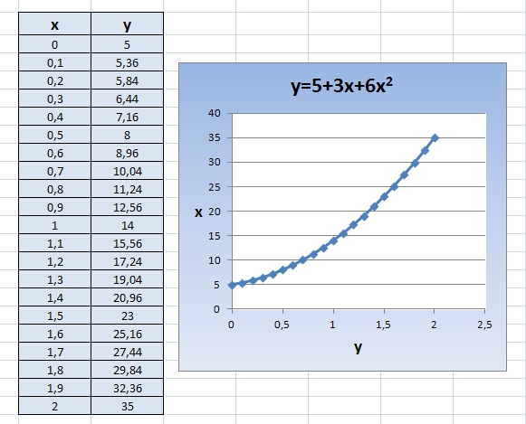
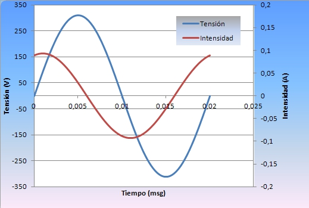

# U4. Propuestas didácticas

En el Módulo 1 presentamos algunos ejemplos prácticos de utilización de gráficos en nuestra vida docente.

Una de las posibilidades consiste en utilizar gráficos** de dispersión** realizados a partir de datos obtenidos mediante fórmulas: representación de funciones y=f(x), carga y descarga de condensadores, aplicación de la ley de Ohm...

Es muy útil a la hora de representar varias funciones en un mismo gráfico, como podemos ver a continuación

Otra aplicación son los **climogramas**. Para realizarlos necesitamos utilizar un gráfico combinado. Los pasos a seguir son los siguientes:

1. A partir de los datos crear un **gráfico de líneas** que represente temperaturas y precipitaciones frente a los meses.

2. **Cambiamos** el tipo de gráfico de las precipitaciones a **gráfico de columnas**.

3. Añadimos un **eje secundario** (seleccionando la serie de las precipitaciones --- botón derecho del ratón --- dar formato a la serie de datos --- activar eje secundario.

Siguiendo estos pasos logramos un gráfico como el mostrado a continuación:

En los siguientes enlaces puedes ver otros ejemplos de uso de gráficos en clase:

- Ejemplo 1: [Mi clase en la nube](http://miclaseenlanube.wordpress.com/mat/tratamiento-de-la-informacin/grficos/)

- Ejemplo 4: [Dulces de colores](http://www.eduteka.org/HojaCalculo4.php)

- Ejemplo 2: [Salven la merluza](http://www.educ.ar/recursos/ver?rec_id=90958)

- Ejemplo 3: [Aristóteles versus Galileo](http://www.cienciaredcreativa.org/informes/caida%202.pdf)

Y a partir de aquí, solamente tienes que pensar otras formas de aprovechar los gráficos.

